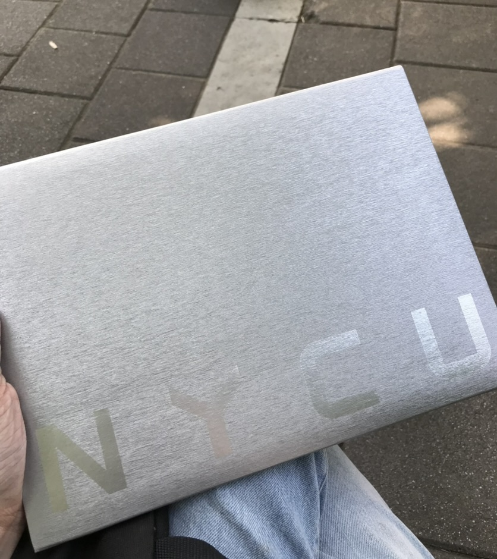

2023 Q1 都要結束了，才鼓起勇氣來整理雜亂的 2022 \_(:3 」∠ )\_

希望透過回顧與整理向去年好好告別，讓自己能對架構理想生活有更多想像、更充滿信心，並能保持思考、保持學習、保持快樂。

2019–2022 是我人生最混亂的時候，有探索、有挫折、也有懷疑，謝謝朋友們、舞團老師夥伴們、實習和工作的同事夥伴們、以及我的家人們在這段時間的陪伴，也謝謝不放棄挑戰，堅持走下去的自己。

<!--truncate-->

## 回顧讀大學這件事

### 高中的目標輪流轉

高中的我可說是非常三心二意，志願在三年間不斷變換。曾經想過要念建築系，後來因為受到對生物這麼科目的偏好、一些對犯罪影集喜好的影響，目標轉換成了醫檢，因而念了三類。在各種課外書與影視節目薰陶下，後來一度想念心理系，但在參加過台大電機營後，不明所以地又把志願改為電機 / 資工。

歷經曲折恍惚，最終學測成績不達理想想直衝指考，卻在家人慫恿下還是填了志願去面試，最後直接落腳在了與前述毫無相關的交大工工。

### 進入大學

剛進入大學的我，對未來可以做的事沒有想像，只是好像到了一個以前不斷在預想著要去的地方，當到達目的以後，在沒有明確道路的這個地方，只能自己不斷挖掘、建設、往也許還不知道是哪的前方邁進。

我玩社團、修外系的課、出國交換，瞭解自己可能不想往工工發展，但又不清楚自己想／能做什麼。

透過修設計相關的課程偶然接觸到了介面設計，進而認識設計思考與使用者體驗，開啟對 HCI 領域的興趣。這裡放上一些我認爲對我有所影響的課程：

*   智慧生活與場域義築（交大建築所）
*   智慧生活與創新設計（交大建築所）
*   傳播與認知心理學（交大傳播所）
*   使者中心互動介面設計（交大資工所）
*   使用者經驗與易用性評估（交大資工所）
*   行為改變設計（清大服科所）
*   使用者研究方法（清大服科所）

而在一番摸索以後，我透過在新芽的產品管理實習，參與軟體產品管理，從和團隊一起定義問題、尋找解法、優化迭代的過程中，瞭解打造科技產品的魅力。感謝能和很棒的團隊 aka 我的職場老師們完成以下專案：

*   統計圖表 — 使用者訪談與研究、圖表優化
*   問卷範本頁 — 流程與競品研究、頁面功能優化
*   多語言問卷 — 功能規劃

現在回想起來一切都是如此地湊巧，如果不是被迷惘和焦慮籠罩，我可能就不會做這些嘗試，就也不會找到那些讓自己眼神發光的時刻了。雖然老套，但當個「積極的迷惘人」，還是有些道理的。

### 從大學畢業

在 2022 年的七月，我從台北租屋處回到新竹跑離校，只不過是過去六年，卻好像已經費盡百年，終於來到這個最後的 RGP 魔王關卡。

領完系上的紀念品後，也去領了學校送的紀念品和寫著與入學校名不同的畢業證書套，還好延畢前就有買可能絕版的證書套、系上也有一張交大工工系的紀念證書，掛著不同校名的證書們各有歸處。

看著拿到的那四張紙（中英文畢業證書＋兩張學分學程），內心比起激昂是更加感慨，過去的大學時光，無論瘋狂、勞累、挫折、掙扎，這一刻，一起成為了這幾張紙和成績單上 173 學分的數字，頓時覺得有些單薄。

走出學校後，覺得終於把過去殘破的自己拼成一張張證書，然後完整而光鮮地（？）附在履歷上，宣告著「我符合社會所要求的完整」。

## 對大學的感想

對我來說大學是一個衝撞自我與探索的地方，它給我資源和舞台去認識不同的人、嘗試不同的事、做出對未來自己有影響力的選擇。大學對我來說很棒的幾個點：

*   **深入的資源**：現在透過網路有很多的學習資源，我自己也常利用線上課程、網路文章、Podcast 等管道學習，但很多深入的理論、方法，是在學校才比較能接觸到的（但通常是研究所的課）（以及與實務一定有落差）
*   **多元的、門檻較低的嘗試機會**：像是之前曾在交大計中做過使用者訪談工讀生、曾在使用者經驗與易用性評估課堂和模流分析軟體公司合作研究、曾透過學長姐提供的資源去做兩週將資金翻倍的計畫等，都是因為作為大學生而得到的機會。

但同時，作為一個延畢生也要老實說，我時常感受到在體制中的困難，甚至有些時後會認為我被困在其中。

*   **被科系綁架**：越長大越會發現，不只高中時對各個科系沒有足夠的瞭解，進了大學也會因為對工作型態不夠了解而侷限自己的學習。進入到大學的前兩年我在各種必修裡探索，等到發現自己真的不適合，緊接著就會被下一階段對研究所／就業的迷惘而襲擊，覺得自己好像沒有其他選擇，或是要轉換領域就必須要再去修一個系、補一個學歷才能達成。
*   **社會規範壓力**：在真的意識到自己不適合所屬的科系、卻又沒有轉系轉學的明確目標時，我們有沒有停下來的選項？在大學學歷稀釋與對人生有標準流程想像的社會之下，休學、自學、先去工作，能不能成為一個不被批判的選擇？在學期間我選擇休學一學期去全職實習，在面試時常會有面試官不解，但我卻深知那可能是對我初出社會的職涯選擇影響最深刻的一學期。

整體的回顧十分簡略（對我來說）卻很混亂，總而言之我對讀大學的整體歷程可說是又愛又恨，在體制之下花費很多時間在符合畢業門檻，同時也為找尋自我跟探索嘗試而忙得焦頭爛額，並因為人生時程及發展方向和身邊同學相異而感到焦慮。

不過在這樣的旅途中，我也帶走了不少東西，像是對人與科技的好奇心、面對學習新事物的挫折，還有和很多有趣人們交流的體驗和關係。

離開了學校，但對生活與職涯的學習還在繼續，希望未來時不時回來回顧這篇文章時，能夠發現儘管場景與困境不同，我仍然會是那個不斷嘗試與突破的人。
