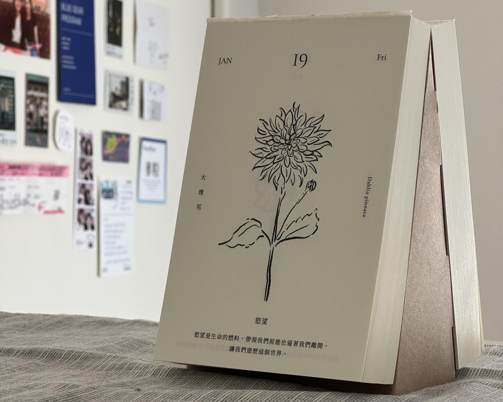

<!-- 以上是設定區塊 -->




2023 是流動的一年，進入職場一年半，卻可說是在一個漂泊的狀態，在許多層面的轉換和變動以後，有些部分變得清晰，有些卻更模糊了，雖然如同畢業前預想走在軟體產品管理的路上，卻仍時常有感到迷惘與挫折的時刻，在年中覺得自己陷入一個偏向痛苦的狀態而尋求解方的時刻，看到了[**產品經理 Reflection 的技術**](https://petersuppi.medium.com/%E7%94%A2%E5%93%81%E7%B6%93%E7%90%86-reflection-%E7%9A%84%E6%8A%80%E8%A1%93-1949da556b68)，發現也許對個別事件的檢討與修正對現階段的自己已經不足夠，應該更全面地復盤個人與工作的現狀，釐清目前的所在。延伸到這一年的結束，希望透過反思整理，把這一年的變動，變成成長的養分，於是就誕生了這一篇冗長的（？） reflection 文章。

<!--truncate-->

因為想涵蓋個人的方方面面，參考 [Designing your life](https://www.books.com.tw/products/0010733134) 的 HWPL 儀表板，將 Work、Health、Play、Love 幾個面向分別檢視，由於 Health & Play 被我共同歸類到了身心理健康照顧，所以合併成了同一個部分：

```
． 2023 Work
． 2023 Health & Play
． 2023 Love
```

---

## 2023 Work

從畢業到現在一年半的時間，從傳統銀行數位部門、教育科技新創，輾轉又回到了實習的公司為工具型 SaaS 產品工作，雖然仍然是個菜到不行的 PM，但接受了一點點社會的洗禮、反覆進到新環境和快速上手職務以後，在現在的職位中還面對著要負責分派與引導 Junior PM 進行功能規劃的任務，意識到 PM 真的是個要不斷面對變化與挑戰的職位，就算是這麼短暫的時間裡，也足以為自己整理出幾點階段性的 key learning。

### 除了做的事情，環境和人是大大影響成長與發展的因素

說到 PM，在不同公司要做的職務範疇真的是百百種，即使都脫不了從競品研究、流程規劃，到整合設計與工程落地的核心任務，但在不同環境之下，會面臨的限制與挑戰也都十分的不同。

在大公司可能會遇到繁冗到不行的流程、在小新創則可能只能自己從零創造流程；可能受流程和產業所限半年更新一版、或是在兩週一個 sprint 高速運轉之下快速迭代。迭代速度並沒有好與壞，但每個人都有自己喜好的步調，都體會過了才知道，我喜歡保持彈性但穩健的流程，並且學生時代被灌輸的 MVP 觀念早已深植我心，緩慢的版本更新與層層流程規章限制會讓我感到煩躁以及與時下軟體開發脫節。

人的同質性也是對工作舒適程度影響甚大的一個因素。在大學畢業以前，總是窩在同溫層裡，從沒想過會聽到「你知道為什麼公司不做 UX 嗎？因為難以落地」、「我不在意產品的發展，做人比做事更重要」等言論，現在對於能遇到相對重視體驗、重視產品發展的人們都超級感恩惜福🥺

非常認同在[志祺七七對 Heptabase 共同創辦人詹雨安 Alan 的訪談](https://youtu.be/BBPAc5Dy9EQ?t=852)中，Alan 所提到的：

> _「不論我再怎麼努力地去保持它（個人價值觀和思想）的獨立性，它受到環境的影響是非常大的。」_

我在剛畢業的這一年半裡做了不止一次可能會被認為是不穩定的抉擇，但若回頭探究：

:::note 我其實在探尋的是一個我能有機會朝自己理想發展的環境，並且和我希望與之學習或共同成長的人們合作。
:::

### 釐清我對科技產品的想像與信念：促進日常生活與個人發展，幫助人們獲取、學習、創造

在畢業之初，只著急地想進入職場，沒有深入地思考自己究竟為何著迷於打造科技產品？除了用戶體驗以外，我想透過參與打造科技產品的流程，對社會造成什麼樣的影響力？

因此在回到實習的公司擔任 SurveyCake Product Manager 之前，我列舉了我進入過（及即將回到）的產品最初吸引我的面向，釐清我自身對科技產品的想像，以及一些真正接觸後的學習點：

#### 網銀 APP

*   想像：從出國交換到實習，網銀漸漸成為我 Daily use 的 APP 之一，對我來說貼近日常並促進生活的工具
*   學習：事實上若以傳統銀行的金融科技產品來說，它的核心不是工具，是被高度監管的金融商品平台

#### 線上學習平台

*   想像：在就學階段，我深刻感受到被教學體制綑綁，認為線上學習是現代教育的一個突破口，能夠為現在的學生提供不一樣的受教方法
*   學習：若是依循傳統出版與補教方法，將舊有的體制數位化，並不能達到自己預期的翻轉或補足教育體制缺口的影響力

#### 線上問卷平台

*   想像：在使用越來越多工具型 SaaS 產品後，我開始覺得這可能會是在現代最能幫助個人（或像公司這樣的群體）創造價值的科技產品類型
*   學習：問卷的價值來自於獲取（收集問卷填答）與輸出（資料和圖表），但這些流程的核心是由用戶的創造（問卷設計與製作）而生

在羅列各個產品後我才理解到我對科技產品的定位其實一直都是某種**能夠促進日常生活或個人發展的工具，我想做到的是藉由打造這些產品，幫助人們獲取、學習、創造**。

我從前公司自己從 0.1 到 1 規劃線上學習產品 [OneStudy+](https://live-study.oneclass.com.tw/) 的經驗裡學到了很多溝通和管理的眉眉角角，但也更加意識到：

:::note 符合自己想創造的價值和影響力是對我來說十分重要的成就感來源。
:::

### 保持健康的工作心態：不追求不斷提升生產力、用客體方法檢視問題、取得與給予正向回饋

初入社會的這一年半以來，高敏感的我經歷了多次的陣痛期，反覆調整自己對工作的期待與觀看方式，才讓工作與生活稍稍平衡，用以下三點幫助我建立更健康的工作心態：

#### 1\. 不追求不斷提升生產力

不管是在高度競爭的大學時期還是 PM 這個職務角色，我都時常陷入不斷追求提升生產力而讓自己耗竭的誤區，在看了[人生四千個禮拜](https://www.books.com.tw/products/0010914255?sloc=main)以後，我才意識到應該要從工作與生活的方方面面跳脫出這樣的負面循環。

> 生產力是一個陷阱。增加效率只會使你忙得更不可開交。

當過度追求生產力時，我會將工作塞進生活、生活分解成學習片段，試圖把每段時間都用所謂「有意義的事」去填滿，但這麼做卻是讓我不斷消耗自己，不能生活在當下。

> 我們脫離了當下，我們的生活永遠在想著未來，擔心事情會不會順利發展。我們感受每一件事的方式是期待日後會出現的好處，因此終日惶惶不安，更不可能體驗到「深層時間」。

:::note 於是我停止塞滿自己的時間，而是有意識地去選擇，賦予選擇的事件意義，並從中得到更多的滿足感。
:::

> 你至少能在做不到的時候，不再責怪自己。由於你不得不做出困難的抉擇，重點就是學著以清醒的頭腦決定要專心做哪些事，哪些則不去管，而不是預設全都要做。

#### 2\. 用客體方法檢視問題

因為 PM 這個角色的特殊性，即使是個小菜鳥，但卻需要如同管理階層一般，去觀察和理解不同團隊成員的行為模式，並嘗試為他人建立支架，為總體成果負責。在前一份工作有陣十分低迷的時刻，當時的我對於還在缺乏支持系統的狀態下摸索與推進自我成長，卻為要同時背負起他人的成果感到挫折。

剛好那時候在 Samuel 主辦的產品讀書會裡讀到[領導者的意識進化](https://www.books.com.tw/products/0010885596?sloc=main)，很大程度的幫助我**抽離當下的角色，學習用客體方法檢視問題，並覺察自己、團隊成員、主管的心理狀態**，更了解自己可以怎麼看待與面對問題。

> 她並非以觀眾的身份站在舞池觀看，她理解到自己的行動創造了這場舞蹈，她一邊看一邊編排。

特別喜歡書中這一段話和過去街舞經驗的重合，譬如個人對團隊的塑造到公司的跨團隊動態，就如同從個人動作、排舞整體性、變化走位協調性、到觀眾的觀看角度。

:::note 舞蹈和工作場域都是由不同層次的觀點組合而成，而切換層次的能力是從不斷練習與實踐的堆疊累積而來。
:::

#### 3\. 取得與給予正向回饋

在經歷幾次工作陣痛期之間，我發現團隊互動除了站在一個推動者的角色下造成的消耗以外，也有許多時刻是能夠帶給我能量的。

比如在 Sprint Retro 的時候從工程與設計得到的正面回饋、離職時收到工程師的小卡（工程師的小卡耶！），都能讓本來容易畏畏縮縮的我更有力量，了解到原來菜鳥本鳥建立的流程是確實有幫助的、我不只是在從他人身上索取，而是我們都在相互學習。

:::note 這樣的經驗讓我也更願意給予工作夥伴們正向回饋，在團隊裡與自己身上形成工作動能的正向循環。
:::

---

## 2023 Health & Play & Love

由於在工作層面不小心就打了落落長，只好將剩下的 Health & Play & Love 以及小結拆成第二篇：

[**2023 Reflection | Part II — Health & Play & Love**](/blog/2023-reflection-part-2)


<!-- 以下是訂閱表單區塊 -->

import NewsletterForm from '@site/src/components/NewsletterForm';
import BrowserOnly from '@docusaurus/BrowserOnly';

<BrowserOnly>{() => <NewsletterForm />}</BrowserOnly>