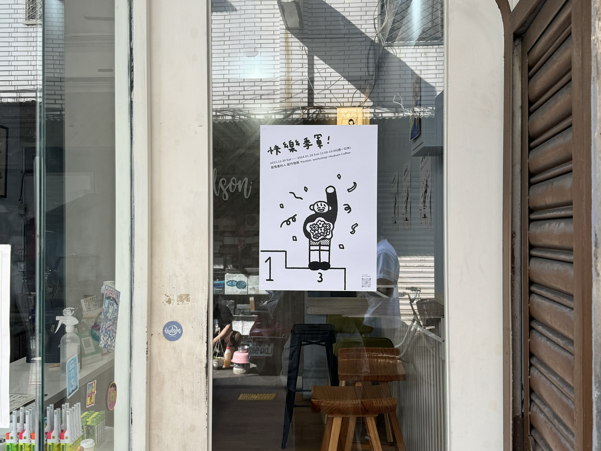

承接前一篇 [**2023 Reflection | Part I: Work**](https://medium.com/@MileyChen/2023-reflection-part-i-work-538f2d8f8f24)  回顧完 2023 工作部分，這篇將回顧的是：

```
． 2023 Health & Play
． 2023 Love
． 2023 小結
```

<!--truncate-->
--- 
## 2023 Health & Play

### 允許自己放鬆、放空與遊樂

如同在上一篇所回顧的不追求不斷提升生產力，留給自己放鬆的空間是我從大學以來的課題，大學時用學分和活動把生活塞滿，出了社會則是變成下班還在想著工作、下班仍覺得自己沒有上一些課或做 side project 就很焦慮的狀態。

在 2023 的後半，我趁著換工作前出國到清邁找備考中到處游牧的瓜瓜，很短暫地完全抽離工作，在那個步調很鬆但有著許多遠端工作者的城市，又認識一種新的生活型態。

> _「工作是為了生活。」_

開始工作後約一年我才比較能體會這句話的意義。

追根究底也許仍然是和我持續在處理的課題相關：「不要把自我價值建構在外在成果」，要容許自己適當地、依照自己舒適的步調成長，而不是為了不斷追逐成果而逼得自己連鬆一口氣的空間都沒有。從開始可以遠端工作的生活型態轉變開始，我給自己更多「屬於自己的時間」。

:::note 看電影、野餐、看書、聽專場、或是單純地躺著耍廢，在這些生活的空檔，再學習自己覺得有趣的事，用屬於自己的步調成長。
:::

### 從熟悉的運動作為起點：讓跳舞回歸遊戲

上班以後坐著的時間變成是八小時起跳，下班又時常耗盡能量地躺在沙發上，覺得這樣的生活太不健康的我嘗試過進健身房，但最後還是被惰性打敗。於是發現，被我因健康狀態中斷、荒廢已久的街舞，仍是我唯一喜愛並有辦法持續的運動項目。中間很久沒重啟練舞除了覺得肌肉量低下的自己很難馬上回歸原本強度以外，也包含了過去對追求要變得更強卻不斷感到挫敗的退縮感。還好過去的一年有朋友的練舞邀約，讓自己漸漸重拾跳舞時的快樂，慢慢回歸上課與練舞。

> **讓喜歡的事回歸遊戲，才能長久地持續，並專注在自己對這件事本身的感受與體驗。**

### 讓心態不再漂泊：專注在營造自己的生活與安全空間

身為一個從上大學到工作越漂越北的南部小孩，宿舍和租屋處對我來說總是「該有的都有」就好，完全不曾悉心營造屬於自己的空間，從小就習慣沒有房間真正屬於自己，離開了家就更像是株沒有根的植物，現在的住處也不是屬於我的歸處。

在[無解的日常題目](https://www.books.com.tw/products/0010971398?sloc=main)中，我特別喜歡「房間」這個篇章：

> _在二十二歲之前，我的房間權限一直不只屬於自己，直到入住這裡，我才明白上鎖房門是一種奢侈，而真正的富有，原來是擁有自己的空間與時間。_

在開始遠端工作以後，才意識到**即使是租屋處，現在的房間承載了我所有的生活，無論身心理上都是屬於我自己的安全庇護所。**於是我調整了房間擺設、重新整理與佈置自己的房間，讓陽光可以灑落在我工作的座位和床頭，捨棄只是堆積著卻總捨不得的物品和衣服，放上香氛吸吐著喜歡的香氣，並用一隅有花的日曆細數著生活的每一日。

> _我的房間永遠允許我，以任何形式存在，即便出了房門，這世界的雜音不會善待我，但只要在房間裡，我的世界就是安靜的。_

:::note 有了這樣的意識與整理後，待在房間裡總很神奇地感受到安全，也有了更多對生活的掌控感。好像把自己的心也跟著整理了乾淨，準備好容納更多的思緒、更多樣的自己。
:::

---

## 2023 Love

2023 的我得到了、也付出了很多的愛，和摯友們更緊密、經歷一段關係的終結，在這些愛之中學習著用更多的愛去愛自己。

### 真正的情緒穩定：面對、消化、溝通

近年很流行講求人在感情中的「情緒穩定」，似乎變成了一種標語與條件，在某些人的解讀之下，有時會變成好像有表達出某些情緒就是錯誤的，但**情緒是我們對不同事件的反應，不論是生氣、難過、哀傷、喜悅，都並沒有正負面之分，而是無形地展現著我們對這個世界的觀點**。

:::note 真正的情緒穩定並不是沒有情緒，而是能夠自己面對與消化這些不同的觀點和感受，並將之分享、表達出來，促成溝通。
:::

### 關係的安心感是雙向建立

現在的人際網路很像我為自己構建的安全網，有時候會覺得我的朋友們怎麼都那麼能夠承接我的情緒和狀態，也因此向昱融提問過不知道為什麼我會能夠打給你哭呢？為什麼身邊的人會願意接住這些樣態的我呢？

> _安心感一直都是雙向給予的呦_

這樣簡單的回覆卻讓我恍然大悟，

:::note 我以為我的朋友們是我的安全網，但事實上我也是網的一環。關係總是雙向建立，安心感也都是相互給予的，當能夠彼此分享、彼此理解，才能夠拉緊這張網，承接彼此。
:::

---

## 2023 小結

### 1\. 給自己的一些小 Memo

*   **有意識地生活**：先從意識到自己沒有意識開始， 在每一個抉擇的當下， 意識到自己的限制、意識到選擇的理由，讓生活是由自己選擇而來，用意識為自己構建滿足與意義。

> 「有意識的生活，不要陷入 default 模式，時刻問自己現在最重要的是什麼」- 矽谷輕鬆談 ep.160

*   **提高解析度**：提升向內與向外的廣度、深度、時間線，以及調節解析度的能力。

### 2\. 一些小目標

**Work**

*   學習用數據更好地支持決策
*   優化團隊規劃與時程安排流程
*   定期自我紀錄 reflection

**Health & Play**

*   保持跳舞、挑戰潛水與雪板
*   持續營造理想的生活空間
*   多曬太陽多出門走走

**Love**

*   和摯友家人們保持分享、理解、溝通
