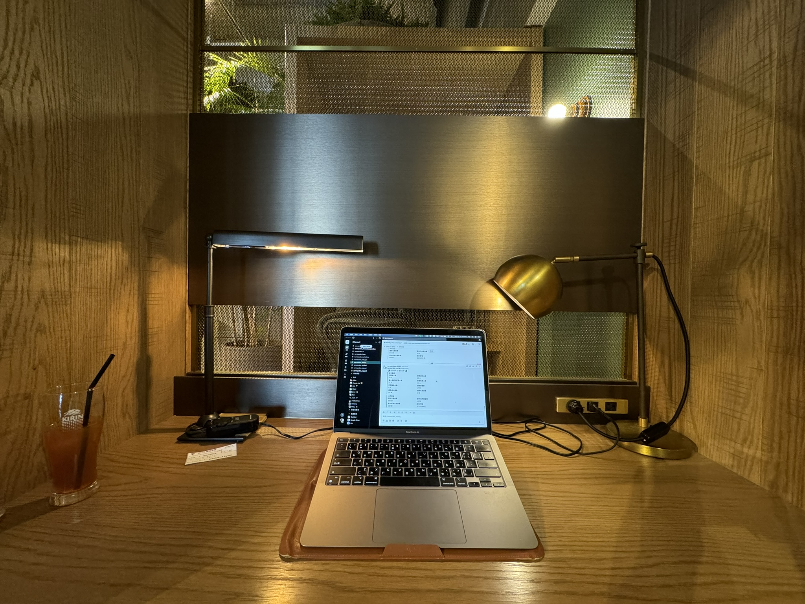

生活在訂閱制爆發的年代，本來十分排斥訂閱制都盡量使用買斷產品的我，近兩年開始訂閱的服務也開始越來越多，決定來紀錄自己訂閱了哪些服務以及訂閱的原因，確保這些定時被扣走的錢錢不只是拿去換了酷東西，而是真的對我的生活有長期助益。

<!--truncate-->
---

## 生產力

[**Heptabase**](https://heptabase.com/): early bird USD 6.99/m (original: 8.99/m)

:::note 使用目的：思考、研究、學習
:::

*   大學時期嘗試用過許多種筆記軟體，HackMD、Notion、Obsidian、Logseq 等等，但沒有一項我有辦法長期地使用並完全融入我的思考與學習流程之中，學習如何使用它們的阻力永遠都比做好筆記的動力更大，讓我常常回到紙本的懷抱之中，或是混合著 goodnote、Liquid Note、Marginnote 各處試驗，無法統一管理所有筆記。
*   認識 Heptabase 以後像是開啟一個新世界，原本的學習方式終於可以在電腦實現，**從記得很隨便的隨筆到書本的 highlight 都可以統一管理與關聯**，雖然現在 Journal, Task, Tag 這些大概一半的 APP 因為各種原因我還沒什麼在使用，但光是卡片與白板就讓我覺得從 2022 年 3 月訂閱到現在是值回票價的。
*   尚未很好整合的流程：任務管理、手寫筆記、平板編輯

[**Readwise**](https://readwise.io/): academic discount USD 4/m (original: 7.99/m)

:::note 使用目的：自我設定的資訊來源、匯入文章影片重點紀錄
:::

*   透過網路接收到的資訊越來越雜亂，要**過濾雜訊專注在對自己有價值的資訊**上變得越來越有難度，曾經使用免費版的 Feedly 來管控自己想要接收的資訊，但會遇到的問題是無法**很好地紀錄重點，或是額外再將別處的內容搜集到同個軟體管理**。
*   一開始試用 readwise 其實只是想將 Kobo 電子書的畫記匯入到 Heptabase 裡整理，卻湊巧的發現上面那些無法被滿足的痛點都在 readwise 很好地被解決，雖然因為價格猶豫了好一陣子，但在最終發現能夠使用 academic discount 以後就馬上訂閱下去ᕕ ( ᐛ ) ᕗ 得到 discount 的方式不困難，就算原本註冊是用私人信箱，只要聯絡客服提供學校信箱／ID就可以獲得優惠。

:::tip
如果想瞭解 academic discount 可以參考[這裡](https://help.readwise.io/article/28-does-readwise-offer-an-academic-discount)的官方說明，沒有學生相關證明的話也可以使用我的連結得到額外一個月的免費使用：[https://readwise.io/i/miley5](https://readwise.io/i/miley5)
:::

## 雲端空間

**iCloud**: 200GB TWD 90/m

:::note 使用目的：照片備份、電腦檔案備份
:::

*   由於手機與電腦都是蘋果生態系的緣故，照片和電腦檔案存放在 iCloud 上是最不費力且便利存取的選項

**Google One**: 200GB TWD 900/y

:::note 使用目的：協作檔案、舊檔案保存、Office 替代品
:::

*   原本大學的雲端是無限容量但砍到剩 15 GB，大學以來累計的快 100 GB 資料，因為 Google doc, Google sheets 等無法直接批次轉換成 Words 或 Excel 格式，為了保存只好用 Google One 安身
*   Mac 電腦本身沒有 Office 軟體，所有相關 Words 或 Excel 相關文件只能傳到 Google 雲端上操作

_雲端空間應該是目前最希望能夠整合的，資料總是會需要有空間存放，但兩個生態系因為佔有不同角色都難以放手_

## 娛樂

[**Spotify**](https://open.spotify.com/?): Premium Family TWD 552/y

:::note 使用目的：音樂、Podcast
:::

*   從高中開始使用 KKBOX，音樂軟體似乎就難以從我生活中抽離，開始用 Spotify 後除了充足的各國音樂、Podcast，**良好的操作體驗跟很厲害的推薦演算法**，讓它成為我目前黏著最久的訂閱服務。曾經因為音質短暫嘗試過 Apple Music，但無法習慣操作方式很快就放棄使用。

## 其他

**Uber One**：TWD 120/m

:::note 使用目的：居家工作的良藥（？）
:::

*   完全是罪惡的懶惰在驅使我訂閱，每天到公司上班時幾乎沒有使用需求，但在開始遠距上班後，有時候因為不想出門、有時候因為家附近吃膩了、有時候因為抽不出時間準備午餐，於是常常一次叫兩餐到家裡來。如果能夠戰勝惰性自己準備午晚餐，這是目前最能割捨的訂閱服務……理論上來說啦。

---

以上是目前的訂閱項目，隨時可能再發文紀錄！
