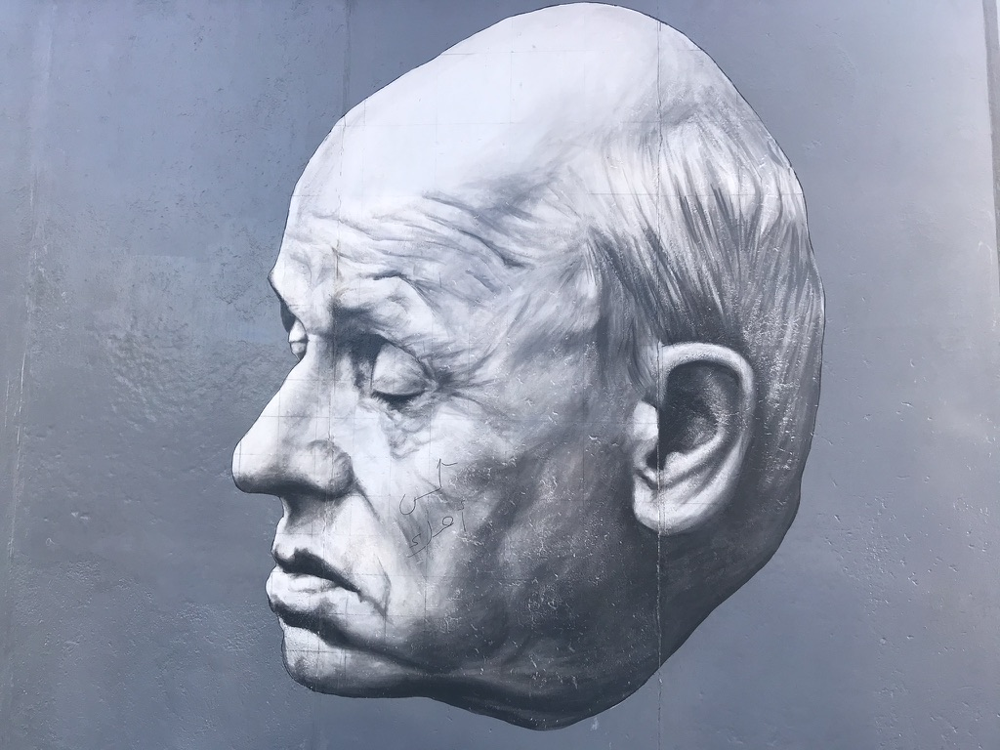

import React from 'react';
import BrowserOnly from '@docusaurus/BrowserOnly';
import Tabs from '@theme/Tabs';
import TabItem from '@theme/TabItem';

<!-- 以上是設定區塊 -->

近期最常吸收資訊的來源是書本、Podcast、Youtube 影片，和一些電子報，這篇主要想紀錄近期常聽的 Podcast 們以及一些舊愛，會想時不時再紀錄與比較當下的清單，了解自己關注的世界有什麼樣的變化。

<!--truncate-->
---

## 近期的愛

**通勤十分鐘 On the way to work**

內容主要是國際商業新聞，偶爾也會分享推薦的書或 Podcast，由於主持人們在多倫多生活，能夠多聽到一些不同於台灣的視角和觀點。是我早晨通勤的良伴，若是在家上班時也會邊聽邊泡咖啡，用新資訊醒醒腦。

**偏見 Preconception**

對其中一個主持人柏韋的初印象是很擅長 Speakers’ corner 的大學學長，建立論點跟口才都非常厲害。從前一個節目 Before Midnight 到現在的 Preconception 我都很喜歡，節目會用平緩的談話步調去和小亦深刻地聊各種哲學與人生問題，常常邊聽邊覺得自己也參與了那一段互相提問與思考的過程。主持人小亦與柏韋是[一隅有花](https://yiyu.florist/)的創辦人，受到節目的影響我今年還買了植物溫柔曆，調性就像節目一樣溫柔而平和，用漂亮的花與充滿哲思的句子開啟每一天（並不是業配 XD）。

**406 台中市北屯區崇德路二段 301–1 號**

因為朋友昱融推薦而入坑，內容如同他們自己寫的介紹是真的很硬，從閱讀帶出許多討論以及思想跳躍的驚喜，每一集長度都超級長，很難一次聽完卻會忍不住聽下去。因為名稱是地址實在太難與別人推薦了！都會說總之是引書店的那一個節目。

**只能喝酒的圖書館 Drinking Library**

被 reels 的各種精彩片段燒到，去細聽每一集都是對來賓或主持人的人生或志業議題深度對談，常常被一些人生觀點震懾或聽到哭。幾乎每一集都會問來賓「你覺得愛是什麼」，就像是不斷對自己或他人反覆地叩問這個沒有正解的問題，但是每次的新答案都是從一種新的觀看角度得到解答。

**矽谷輕鬆談 Just Kidding Tech**

主持人們是在矽谷科技業工作的資料科學家跟工程師，除了科技趨勢以外還可以聽到一些在矽谷工作才會知道的八卦細節，是有趣又有科技新知資訊含量的節目。

**曼報 Manny’s Newsletter**

幾乎不用介紹的科技與商業 Podcast（？）每集的資訊內容與心靈都收穫滿滿！

## 一些曾經的心頭好

### 現在偶爾才點開

*   下一本讀什麼
*   尼爾喝牛奶：你的次文化指南
*   好味小姐開束縛我還你原形
*   最近工作還好嗎
*   哇賽心理學

### 不再更新的遺憾

*   星箭廣播
*   世代登出

### 伴我走過低潮的心理系列

*   心理師想跟你說
*   草木談心
*   說說心裡話
*   靈魂相談室
*   誰吃了我的快樂
*   喂喂你還好不好

<!-- 以下是訂閱表單區塊 -->

export const NewsletterForm = () => {
  const [isSuccess, setIsSuccess] = React.useState(false);
  const [isLoading, setIsLoading] = React.useState(false);

  const handleSubmit = async (e) => {
    e.preventDefault();
    setIsLoading(true);

    const formData = new FormData(e.target);
    const email = formData.get('email'); // 更新為新的 email 欄位名稱

    try {
      const response = await fetch(
        'https://buttondown.com/api/emails/embed-subscribe/thinking-today', // 更新為新的 API 端點
        {
          method: 'POST',
          body: formData,
        }
      );

      if (response.ok) {
        setIsSuccess(true);
      }
    } catch (error) {
      console.error('訂閱失敗:', error);
    } finally {
      setIsLoading(false);
    }
  };

  if (isSuccess) {
    return (
      

        <h3 style={{marginBottom: '1rem'}}>感謝訂閱</h3>
        

          只差一步了！請至信箱驗證你的郵件地址。
        

      

    );
  }

  return (
    

      <h3 style={{marginBottom: '1rem'}}>訂閱最新文章</h3>
      

        歡迎使用信箱接收最新文章，或是你也可以
        <a href="/blog/rss.xml">由此訂閱 RSS</a>
      

      
      <form 
        onSubmit={handleSubmit}
        style={{display: 'flex', flexDirection: 'column', gap: '1rem'}}
      >
        <input 
          type="email" 
          name="email" // 更新為新的 email 欄位名稱
          placeholder="輸入你的 Email" 
          required
          style={{
            width: '100%',
            padding: '0.8rem',
            borderRadius: '4px',
            border: '1px solid var(--ifm-color-emphasis-300)',
            backgroundColor: 'var(--ifm-background-color)'
          }}
        />
        <button 
          type="submit" 
          disabled={isLoading}
          style={{
            width: '100%',
            padding: '0.8rem',
            backgroundColor: 'var(--ifm-color-primary)',
            color: 'white',
            border: 'none',
            borderRadius: '4px',
            cursor: isLoading ? 'not-allowed' : 'pointer',
            fontWeight: 'bold',
            opacity: isLoading ? 0.7 : 1
          }}
        >
          {isLoading ? '訂閱中...' : '訂閱'}
        </button>
      </form>
    

  );
};

<BrowserOnly>
{() => <NewsletterForm />}
</BrowserOnly>
