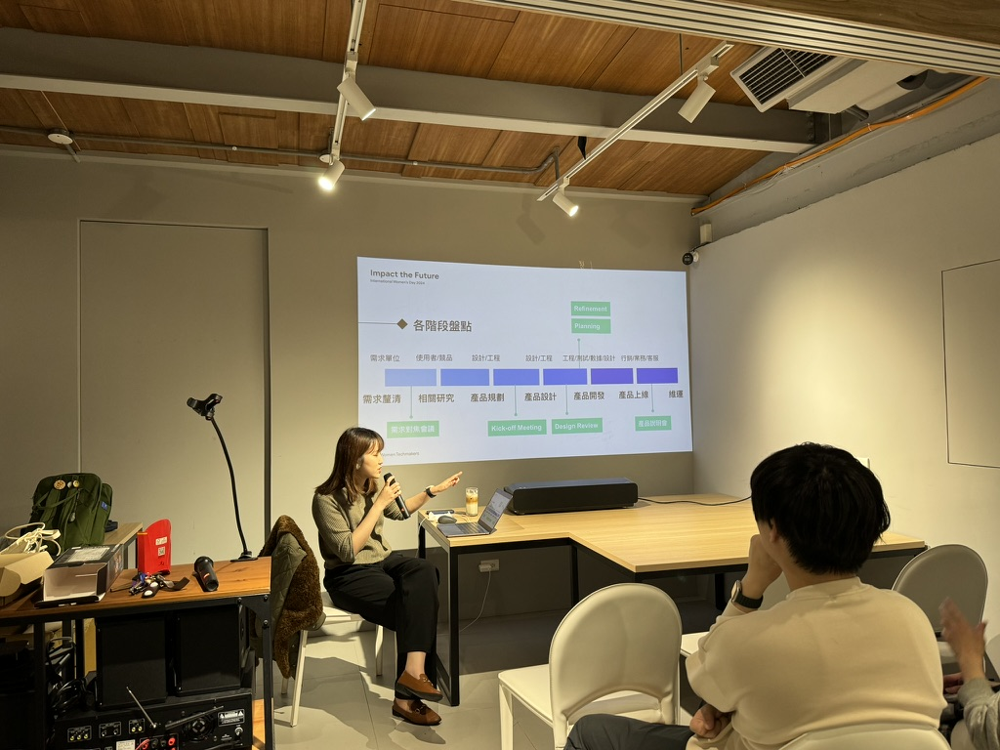
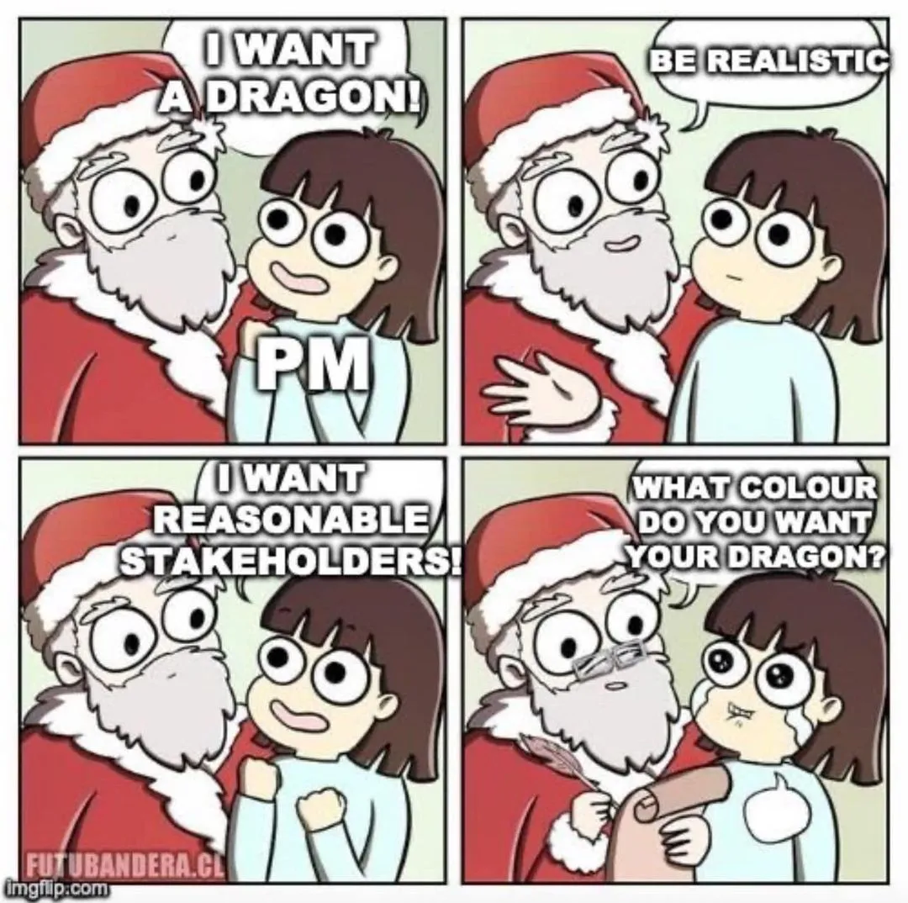
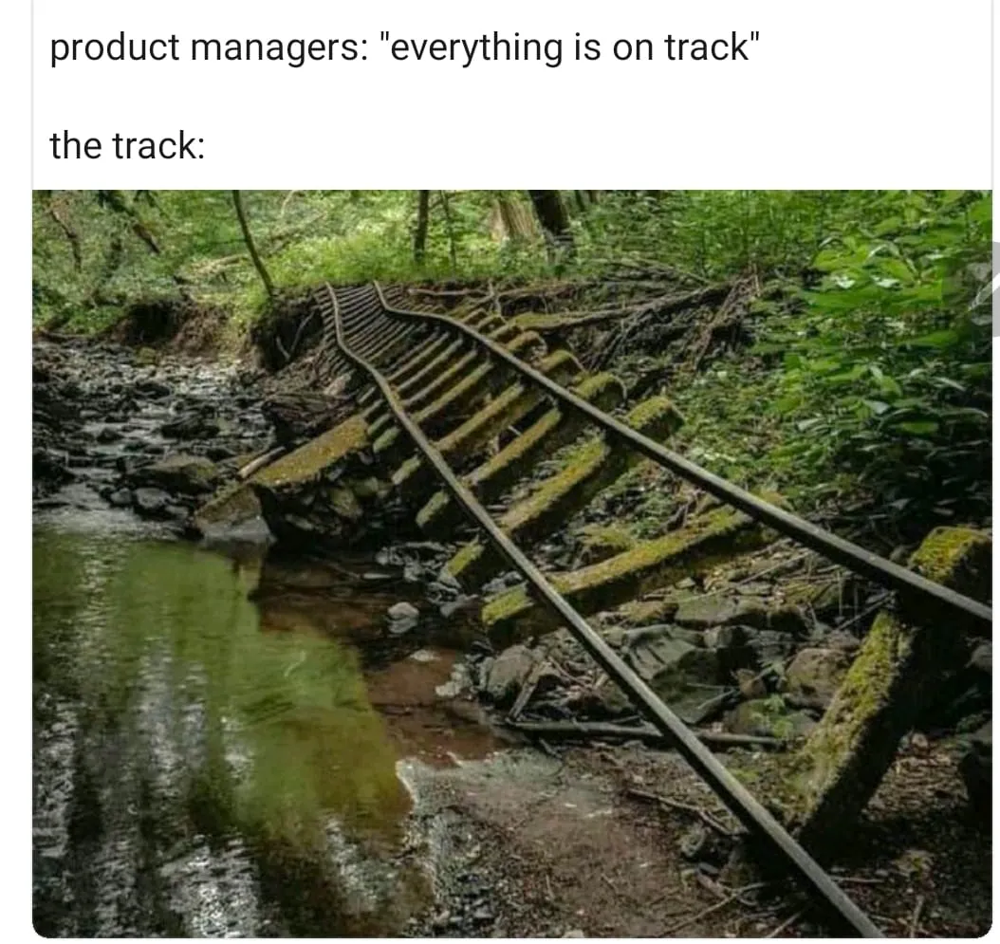
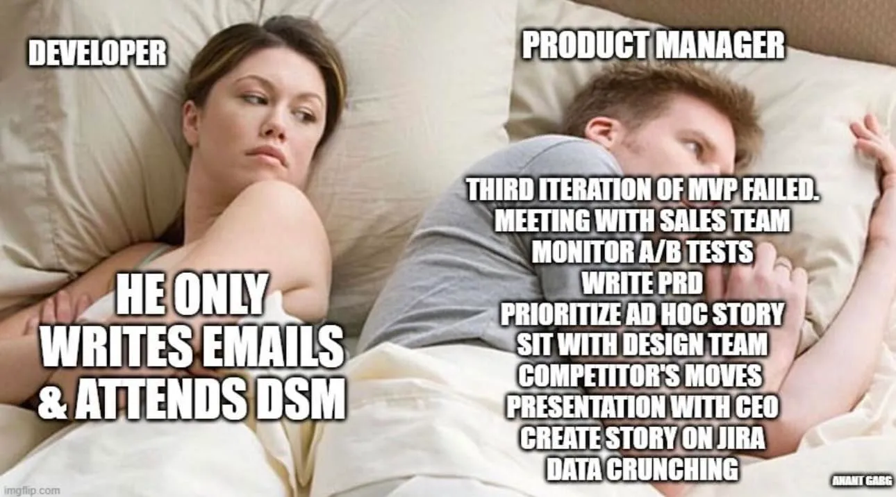
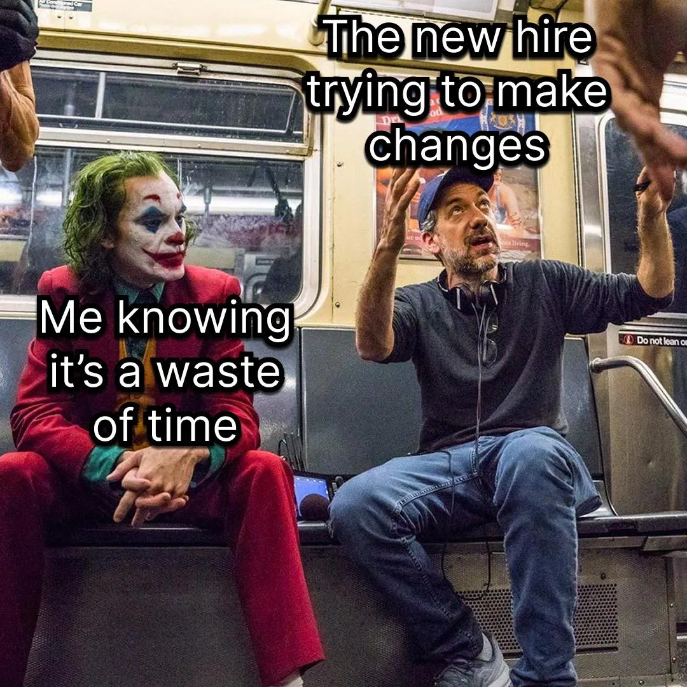
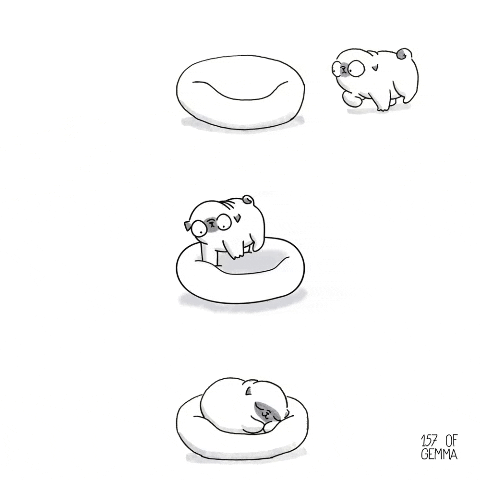

<!-- 以上是設定區塊 -->

這場講座是 Hahow 的 Product Manager Eileen 對 PM 職位的基本介紹跟一些 PM 小撇步，當一陣子 PM 後來聽的最大感受是心有戚戚焉 🥹，於是將簡略的紀錄與微微心得寫成了文。

Eileen 自我介紹時說他的超能力是認識厲害的人，但我覺得應該還有一個超能力是發明 PM 魔法咒語（？），以下各部分都會有一些對 PM 或甚是任何需要溝通的職位很有幫助的小咒語，歡迎對 PM 職位有興趣的人們或想找共鳴的 PM 們繼續看下去。

<!--truncate-->
---

## 當 PM 總是要面對的

### 利害關係人管理

當 PM 很大部份的任務就是和團隊內外的人溝通，常常需要與跨部門團隊或老闆確認需求，在這個面向 Eileen 提到，被提到很多次的許願不代表真正的需求，需求的目的需要 PM 去挖掘。

> _魔法咒語：「請你幫助我幫助你。」_

用這個咒語為開端，向理解需求方真正理解他們的需求情境和目標，可以用五個 Why 來不斷深入更深一層的問題。

### 上線了問題還是在

有時在完成功能、推版後，會發現即使上線了原本希望解決的問題還是在，或是衍生的情況發生，這時候不需要推翻原本做的項目，而是可以使用下面的魔法咒語：

> _魔法咒語：「你不知道你不知道的事。」_

這段讓我很有同感的是，前公司產品在初期做的功能耦合性頗高，加上沒有測試團隊進行完整測試的狀況下（測試人員 aka PM 我），非常常上新功能後才發現影響了其他功能，但這樣的情況下質疑功能的開發、怎麼原本不知道會相互影響並沒有意義，重點是後續行動，當下接續去找尋問題並解決，以及當某些情況化為「知道的事」以後是否能在未來的規劃裡避免。

### 對 PM 的期待不同

不同公司、不同團隊、不同角色對 PM 有各種不同的期待，Eileen 提到團隊合作沒有標準答案，可以用後面會提到的小撇步 1 on 1 來了解團隊成員的期待，也可以在 PRD 清楚溝通目標來凝聚團隊共識。

## 一些小撇步

### 降落新團隊小秘訣

Eileen 分享了幾項降落新團隊時可以加速適應的小秘訣：

*   找合作夥伴 1 on 1：了解期待、前人作風
*   熟悉規格文件
*   關鍵字爬訊息對話（Slack）
*   先筆記再詢問（但查了超過 15 分鐘直接問比較快）
*   Ｐ人忠告：做個 checklist

這幾項我覺得都是非常實用的建議，在融入新團隊時以上的項目大概都做過，我自己小小的習慣上還會增加幾點：

*   確認所有工具與用途：像現職公司除了 Slack，還有 Notion、GitLab、JIRA、Confluence、Google Drive 可能分別在不同用途時適合用來爬過往資料，了解公司工具的不同用途，找到對的地方去搜尋也是重要的前置步驟
*   I 人忠告 —— 要有問爆的勇氣：即使了解了公司的文件系統，很多時候新手還是沒辦法準確找到對應文件、或是對一些公司 social norms 還不了解，也無法事事都靠約 1 on 1 釐清，這時候在新人期有問爆的勇氣就十分重要，額外的好處是問問題的同時也增加了初期與其他成員交流的機會
*   先建立信任，才尋求優化或改變

### 溝通小秘訣

在這一部份 Eileen 有提到包含閉嘴的藝術等從一些書籍中學到的溝通小秘訣：

*   在提問對自己的看法時，用假設語氣追問：你認為我哪裡可以更好？**如果有那會是什麼？**
*   把行動變成身份：e.g. 幫我收玩具 → 當我的小幫手來收玩具
*   在拒絕時把不要改成不能：不要是一種主觀意見，不能是表達限制
*   轉換人稱：拿掉「我覺得」e.g. 使用者研究報告裡面可以看出 …

#### 推薦讀物

*   閉嘴的藝術
*   如何讓人聽你的

### 用認知負荷減少 Burnout 機會

以往對認知負荷的用途印象都是在用戶使用上的設計注意要點，聽到 Eileen 用來管理自身工作方式，覺得非常有趣，她提到了以下幾點：

*   **管理內在負荷**

_內在負荷：事情難易度 vs 個人的專業知識_

*   **減低外在負荷**

_外在負荷：來自事件以外的干擾_

*   **增加相關負荷**

_相關負荷：跟事情無關但可以協助事情處理的元素 e.g. 溝通類比、舉例_

參考來源

*   教學者的基礎涵養 — — 工作記憶

## 對自己的定位

### 回歸目的：想扮演什麼樣的團隊角色

在分享的最後，Eileen 提到適合當什麼樣的 PM，其實還是要回歸目的：你想在團隊扮演什麼樣的角色？

她自己的回答會是擔任團隊的催化劑，讓團隊可以在有了她以後促使事情發生。

PM 有很多的樣貌，重點是取得平衡，讓自己可以盡情發揮自己擅長的事，並對自己不擅長的事進行風險管理。

我自己也許還在摸索定位的過程之中，但近期的想法是成為團隊翻譯機與路隊長，讓團隊成員可以相互溝通、理解，並引領團隊前往正確的前進方向。

<!-- 以下是訂閱表單區塊 -->

import NewsletterForm from '@site/src/components/NewsletterForm';
import BrowserOnly from '@docusaurus/BrowserOnly';

<BrowserOnly>{() => <NewsletterForm />}</BrowserOnly>