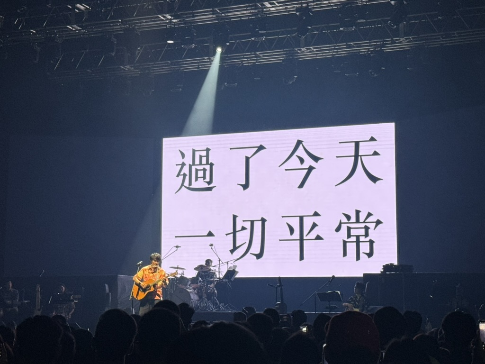

<!-- 以上是設定區塊 -->




去年底加入新工作團隊後就開始一陣衝刺，把團隊堆積的緊急需求清倉，在這之間的某個段落，自己又無端開始迷茫，找不到恢復能量的方法，即使約主管 1 on 1、休假出國也沒辦法好好調整。最終深入省視自己內耗的原因，訂定了一些工作與生活上的行動方案，才逐漸找回內心的能量，同時也更認識自己。寫文的當下其實還差一個月才走到今年的一半，但剛好到了一個從內耗中走出而想寫 reflection 的節點。

```
這次很簡單地劃分工作、生活兩個面向，回顧近期所做的嘗試以及它們帶來的改變：  
． 工作：用思考轉變和行動方案緩解內耗  
． 生活：探索有趣的事，用拓展認知更了解自己  
． 這些嘗試所促成的個人改變  
． 題外話：關於思考紀錄
```
<!--truncate-->
---

## 工作：用思考轉變和行動方案緩解內耗

在回頭檢視平常工作時，我發現最感到耗能的時刻常是源於對自己對細節掌握不足而自我譴責，或是因得不到日常反饋而焦慮。前者部分來自錯失一點內容就會譴責自己的個性、部分來自經手的流程與產品本身的複雜度；後者則是來自對如何有效衡量自己的貢獻還沒有充足的認知，以及團隊相較過去經驗來說缺少回饋機制。

釐清這些困住自己的因素給了我下一步的方向，而我選擇嘗試用思考轉變與行動方案兩種方法來調節內在想法跟外在流程：

### 思考轉變

*   接納自己永遠都不會做得完美，比起已遺失的細節更注重下一步的行動
*   PM 不像設計師與工程師有直接可見的產出，但每完成一個功能的規劃與上線，其實代表著 PM 有在這些流程中好好執行推動團隊的職責，都該在內心給自己一個小小的掌聲

### 行動方案

#### 建立任務細節管理流程

*   將例行任務整理成文件，讓自己可以時刻回頭檢查
*   建立 PRD 模板，將已知容易遺漏的面向、相關需要確認的文件連結放入對應類別的功能模板

#### 推行團隊 retro 制度

*   在和 Tech Lead 溝通的過程中，發現不只自己覺得缺少回饋，其他團隊成員也會感到沒有回饋管道，於是和主管討論後把原本省略的 Scrum retro 環節加進例行的流程
*   第一次 retro 後收到團隊不錯的反響，但第三次就會開始有人覺得懶得想了，仍要繼續觀察是否有更適合的方式

在有了以上的變化以後，工作上的內耗已相對先前好了許多，但對自身能量有爆炸性影響的，還是後面接著提到的，在生活上做的許多嘗試。

## 生活：探索有趣的事，用拓展認知更了解自己

除了工作，我也開始思考可以怎麼調整個人生活的狀態來獲取能量，畢竟自己的生活是我能最大幅度掌握與影響的部分。

一開始對於做什麼事可以讓現狀有所改變並沒有頭緒，於是我從「探索」開始著手，去嘗試各種好像很有趣的事，看看它們能夠帶我到哪裡。而很神奇的，這些事情最終也的確帶我走出了能量低谷！

### 聊聊計畫

這個計畫被開啟得非常隨意，來自跟室友[何雅瑄](https://medium.com/u/b657b91a71d2?source=post_page-----d65545b85fc3--------------------------------)的隨口聊天，講到自己很想知道一些不熟悉 / 不認識但有在追蹤的有趣人們都是怎麼思考人生的方向，他的一句「那就去找他們聊天看看呀」，讓我開始想「對耶，有什麼不可以？頂多不就只是被拒絕？」，於是這個定調在找很久沒聯絡、甚至不認識的人聊聊的小計畫在我心中慢慢成形。

在尋思自己為什麼想這麼做及對我有什麼益處時（aka 幫自己找做這件事的藉口），除了可以練習與人對談的技巧外，還想起了「[弱連結](https://t.co/h74V3F18CP)」這個詞：

> _過度仰賴強連結類似於沈浸在同溫層，很難得到有價值的資訊；製造弱連結則能接收到不熟悉的作法、片段的資訊和見解。_

這個觀點增強了我要做這件事的動力，於是在邊猶豫邊找身邊的朋友先初步聊天測試後，我在某個失眠的夜晚快速擬稿、建 Calendly、隔天送出三則邀請，然後都陸續收到了正面回應。

聊聊計畫的第一個月裡我跟多達四個人聊天，截至目前為止聊了五位。其中有一起修過同一堂課但很久沒聯絡的人、有領域相差很遠的學姊、有完全不認識但我覺得經歷很有趣的人，也有短暫共事但還來不及深入瞭解的已離職同事。

在邀請的時候我都會強調這不是訪談而是一場聊天，而事實上每場也都是漫無天際地聊，我會盡量降低談論工作細節的比例，透過更多個人的面向去了解眼前的人，詢問每個人做不同選擇的背景和原因，以及目前認為人生比較核心的目標與意義，除此以外就是讓談話自由發生。出乎意料地，原本都是只邀約 45 分鐘，但事實上跟每個人都是聊了兩小時甚至以上（希望我未來邀的人不要看到，不然大概會大幅降低邀請成功率）。

從第五個人開始，我在原本針對的選擇、人生目標之上，再新增了關於學習的面向，預期聊聊計畫仍會緩步進行，期待這個計劃能持續為自己帶來新連結與想法刺激。

在剛完成第一波的聊聊計畫時，我看到了 [Expertise and determinism](https://t.co/OuibLa4Zw2) 這篇文章，而其中最引起我當下共鳴的是這段對 macro laws 的陳述：

> _“The more I recognize these attributes, patterns, and macro laws, the more I realize that many of the ‘choices’ I made in the past, although seemingly based on free will, are actually nothing more than a beautiful illusion under the macro laws.“_

我當時正為從不同人的經驗與選擇看到共性而興奮莫名，發現自己享受於辨識規則，並為自己也處於之中感到安心。越思考和學習越會發現自己在世界的渺小，但也越了解過去如何造就未來是有跡可循。

:::note 在這樣的想法之下，很多原本佔據我注意力的願景和目標不再沈重，變得比較像是個只要我專注於當下的快樂與滿足感就終「有可能」會抵達的地方。
:::

### 學習新技能

[去年的 reflection 裡](./2023-reflection-part-2#2-一些小目標)我有訂定一些自己想學習的項目，和工作無關的包含像是潛水和雪板，這些從未嘗試過的不同運動項目，而我也真的在五月初到小琉球考過水肺潛水 OW 證照。

在學習的過程中發現，在泳池裡順暢學會的動作一到海裡就因為海浪、水深、自己的緊張等因素無法順利執行，但邊摸索環境邊不放棄嘗試，最終不只能做到原本學的動作，甚至最後能應用它們越潛越深。

跟朋友說到這樣的學習歷程裡我大概都是恐懼卻快樂著，得到了「你其實很 M 吧」的評價（？）

:::note 從這次經驗裡我好像更深入理解自己是如何從學習中得到快樂，也發現學到的技能要好好應用，總是要經歷一段直面未知恐懼、建立自我信任的歷程。
:::

### HCI 探索：瞭解獲取、轉移知識的過程

這一項又是啟蒙於跟[何雅瑄](https://medium.com/u/b657b91a71d2?source=post_page-----d65545b85fc3--------------------------------)的聊天，真是感謝我身邊的知識寶庫 ꉂꉂ ( ˆᴗˆ )

過程中會發現我們感興趣的點不太一樣，也因此能夠在共同的主題之下進行一些有趣的多面向討論。在討論之中被點出我會拿很多的產品來類比與想像可能性，而我自己從沒想過這種思考方向的特別之處。

依循著思考工具這一條主軸，我發現自己感興趣的範圍還可以前後延伸到 Sketch noting 如何幫助人思考、個人知識在組織中如何轉移等，這些平常生活中該跟個人數位思考工具銜接，卻讓我時常感到有斷裂感的範疇。

好像突然間開啟了一個很廣大、深不見底的學習範圍，雖然認識還很淺薄、在工作之餘探索的速度非常緩慢，但每一步新的瞭解都讓我感到雀躍與快樂。

### 看 N 場發表會

剛好五月是個發表會爆發的月份，以前其實沒有特別看發表會的習慣，但從 Youtube 演算法推薦我 iPad 發表會開始，我這個月實時追了 Apple 和 OpenAI 的發表會、看了 Google I/O 的整理，並在 designtips.io 的[發文推坑](https://t.co/3THEqPOevD)之下看了 Canva Create。

第一時間知道新的發展和想像未來趨勢是一件振奮人心的事，這提醒了我會想做軟體產品，其實就是被能夠不斷思考人類生活方式可以如何改變的特性所吸引。

## 這些嘗試所促成的個人改變

### 比起猶豫不決更優先採取行動

過去的我經常先思考很多可能性和後果然後就止步不前，但從上面工作與生活上不同的嘗試來看，我發現有時若已經有目標或想法，「開始行動」正是能讓自己跨越阻礙的方法。

### 不安於現狀，但不要不安於現狀

在探索的過程中才清楚認知到，我是一個很需要持續有外在刺激的人，這讓我不會安於現狀，願意尋求成長與新體驗，卻也讓我「不安」於現狀，傾向把沒有改變跟停滯劃上等號。 事實上很多時候表面的沒改變是正在擴展自己的能量總和，當自己有足夠能量躍遷到新一階時，改變才可能發生；沒改變不等於停滯，維持穩定狀態也是件不容易的事。

---

## 題外話：關於思考紀錄

從今年開始，為了可以更習慣輸出，我都會在[我的推特帳號](https://twitter.com/MileyChen0u0)發一些日常的思考和閱讀心得，並將每次的推文紀錄在 Heptabase 裡。在寫這篇文章時，感覺像是把近期的推文都串連了起來，很多部分也都是用推文的文字來總結，而這種單點想法連成線的體驗是非常特別且愉悅的。

因此在這篇文章的最後，我想給自己留一個小小的期許：持續記錄自己短短的思考片段，並在這些片段之上組織出更完整的思考脈絡。


<!-- 以下是訂閱表單區塊 -->

import NewsletterForm from '@site/src/components/NewsletterForm';
import BrowserOnly from '@docusaurus/BrowserOnly';

<BrowserOnly>{() => <NewsletterForm />}</BrowserOnly>