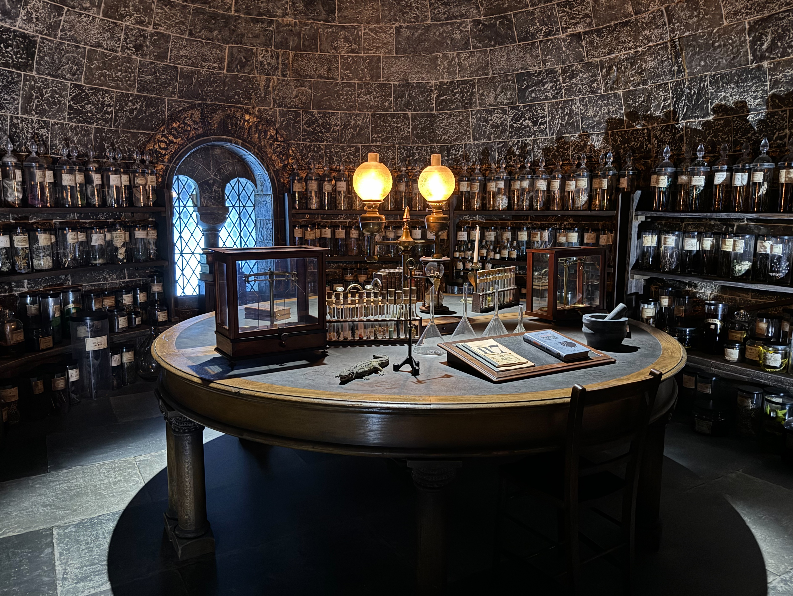
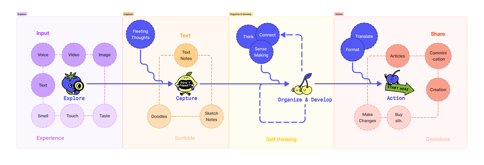

<!-- 以上是設定區塊 -->

這篇文想來紀錄近期比較有意識在思考與建構的個人知識管理（Personal Knowledge Management）運作流程。

儘管這是個通俗的說法，但我其實並不喜歡「知識管理」這個詞，就有點像部分人認為「設計思考」這個詞被濫用，那些思考框架是來自於獲得良好結果過程的歸納，而不是死板的遵從這些步驟就能成功得出好的設計或策略；同理，知識的運作可以被學者、知識工作者拆分成許多階段，但若要能夠在生活中良好地吸收、轉化、應用資訊並累積知識，追根究底還是來自於對自己的認識，歸納出一套符合自己腦袋運作方式的流程。

由於我實在是個很散的人，以下不會有很明確的方法論、框架規範，單純是個人想法的統合整理。
<!--truncate-->

## 參考資料

寫這篇文章之前我也看了一些其他人的流程（結果列出來發現只有某間公司的員工跟我的朋友 XD）

以下流程對我來說有重疊也有借鏡，值得一提的是大家各自的用詞可能有所不同，「Lifecycle」、「系統」、「流程」，但**深入本質，我認為都像是一種「思考的迭代」，這些步驟循環往復、成果堆疊，最終成為最適於現在，更優於未來的我們。**

- Yu An Chan - [My Vision: The Knowledge Lifecycle](https://sheracaolity.ghost.io/my-vision-heptabase/)：`探索 → 收集 → 思考 → 創作 → 分享`

- PJ Wu - [我的個人知識管理系統](https://pinchlime.com/blog/my-personal-knowledge-management-system-2023/)：`探索 → 捕捉 → 發展 → 精煉 → 交流`

- Ya Xuan - [2023 知識生產流程](https://yaxuanhe.me/post/2023-knowledge-workflow/)：`探索 → 收集 → 思考 → 創作 → 分享`

## 我的流程

:::tip 探索 Explore → 採集 Capture → 組織和延展 Organize & Develop → 行動 Action
:::

### 探索 Explore

在初始的探索階段，得到的會是片段的資訊、不同感官的體驗。

#### 資訊輸入

這個部分最常會是透過大家習慣的不同知識載體來獲取資訊，包含文字、影音、圖像、音樂等，在數位時代之中，這些會是最氾濫、最多元、最容易取得，卻也最需要篩選的內容。

:::note 幫助我探索、過濾、收斂、總結的工具包含以下：Arc、Kobo、Spotify、Readwise、Immersive translate、ChatGPT。
:::

#### 體驗

這裡的體驗指的是動用身心五感在真實生活中的場景沈浸，通常除了被動地吸收還會主動同步、甚至是進一步的輸出，比如運動、演奏、對談等。

:::note 對我來說，我近期保持或是新嘗試的體驗有這些：練舞、水肺潛水、雪板課程、聊聊計畫。
:::

---

### 採集 Capture

接續著探索的過程，從資訊與體驗中採集對自己有意義的內容是個重要的過程，並且有許多種形式。這是開始進入神奇腦內運作的一個階段，要嘗試把資訊、思考、感受用最貼近腦中的形式採集下來。

#### 文字筆記

文字是從小到大被教育使用、也最習慣使用的方式，對我來說的好處是它適合用來理解、用來表達，但難處卻是它經常無法足夠貼近我的思考，因此對我來說是個概略的採集方式。

:::note 目前的採集工具：Heptabase（只想短暫保存的部分偶爾還是會用一下 Google Keeps）
:::

#### 圖像化筆記

我並不是個畫畫能手，因此這裡的圖像化會是混和著文字、圖形、插圖等，用各種方式的結合來試圖比文字更貼近腦海中的畫面，比如流程圖、樹狀圖、心智圖、icon、各種排版甚至是手繪元素。

:::note 常用工具：Goodnotes、Figma（FigJam）
:::

---

### 組織和延展 Organize & Develop

在探索和採集後，會需要透過組織來形成更全面的理解、基於理解去發展自己的觀點與立場。

#### 思考、理解、連結

在這個階段裡其實手段是很混合的，我會查看採集而來的內容，找尋連結、理解脈絡、思考延伸發展的可能性。

而這也是為什麼我認爲這整個流程是一種思考的迭代，因為在這個階段中，我很有可能回頭反覆進行探索與採集，以增加我組織與延展的素材。

:::note 在這個階段裡我會使用的工具涵括前兩個階段，但更多的會是需要聚集採集到的資訊，因此以現階段來說會以 Heptabase 跟 FigJam 有較高的使用頻率。
:::

---

### 行動 Action

在建立起知識，有了自己的想法、立場、觀點以後，我認為最重要的部分是如何將這些腦內劇場化為實體的行動。就如同我在 About 頁面提到的 Personal Rules：比起猶豫不決更優先採取行動，行動是開啟新的探索的鑰匙、是改變狀態的推力，也是看見現有思考缺口的方式。

#### 分享

就像是學外文，輸入和輸出是兩種完全不同的理解。

如 [From Digital Sandbox To Digital Garden](https://t.co/mhis0bQz0c) 所提到蒐集想法、寫作、釐清自己的思路是一個連續的過程，當我閱讀了我的寫作我才真正瞭解我所想 `("I write because I don't know what I think until I read what I say." — Flannery O'Connor)`，而在分享過後，也才能夠得到回覆、展開對話，開啟新的探索和聽見不同的聲音。

除了寫作以外，各種型態的分享也是如此，跳舞的人會用舞蹈分享對音樂的理解、攝影的人會用照片展現觀看的視角，除了分享自己，也會去了解別人。

:::note 我常用的工具：Twitter、個人網站（過去是用 Medium）、Instagram
:::

#### 決策

行動的另一個層面是決策，當了解夠多理財知識後決定要投資哪一支股票、當足夠瞭解用戶需求後決定要採取特定解法……這些決策帶領著我們去改變現狀、驗證思考，並不斷因失敗或變化而讓自己意識到原有的認知不足，需要重新從探索開始累積知識。

---

## 更多關於行動

由於過往常常讓許多想法或計劃卡在自己腦內，因此「行動」是我近期最關注並且督促自己執行的一個階段，以下是有關行動的一些引言，希望能用來提醒自己。

> If you just do knowledge work, it's always connected to action.

_[—— 《Exploring Heptabase's 2024 Feature Updates and Future Plans with Founder Alan Chan》](https://youtu.be/dIwvYBzj1oQ)_

> 「資訊」「思考」「行動」三者必須相輔相成，其中又以「行動」特別重要。

> 唯有行動才能得到他人與市場的回饋，這些都是無法從書上和網路上取得的資訊。而且行動帶來的體驗也能促進我們思考，換句話說，行動可以推動良性循環，獲得更優質的資訊與思考。

_[—— 《提高思考解析度》](https://www.kobo.com/tw/zh/ebook/GDLFuRmIZDa7dF9w7VqWYg?utm_content=PMAX&gad_source=1&gclid=CjwKCAjw1920BhA3EiwAJT3lSREhM7G19RvvQJ20l5QP70L2qqK7n-td3E1cIRGeLX67YlGiO46ZSRoCepoQAvD_BwE)_

> 一位 PM 就像是一個產品，不斷修正自己的假設與行動就如同產品迭代 ( Iteration )，持續地提升性能就能夠解決更多更重要的問題。

_[—— 《Blog 81 — 身為一個 PM 新手，我可以如何快速上手工作 (中)，產品經理技能篇》](https://chuhenry.medium.com/blog-80-%E8%BA%AB%E7%82%BA%E4%B8%80%E5%80%8B-pm-%E6%96%B0%E6%89%8B-%E6%88%91%E5%8F%AF%E4%BB%A5%E5%A6%82%E4%BD%95%E5%BF%AB%E9%80%9F%E4%B8%8A%E6%89%8B%E5%B7%A5%E4%BD%9C-%E4%B8%8A-308b72972906)_

<!-- 以下是訂閱表單區塊 -->

import NewsletterForm from '@site/src/components/NewsletterForm';
import BrowserOnly from '@docusaurus/BrowserOnly';

<BrowserOnly>{() => <NewsletterForm />}</BrowserOnly>