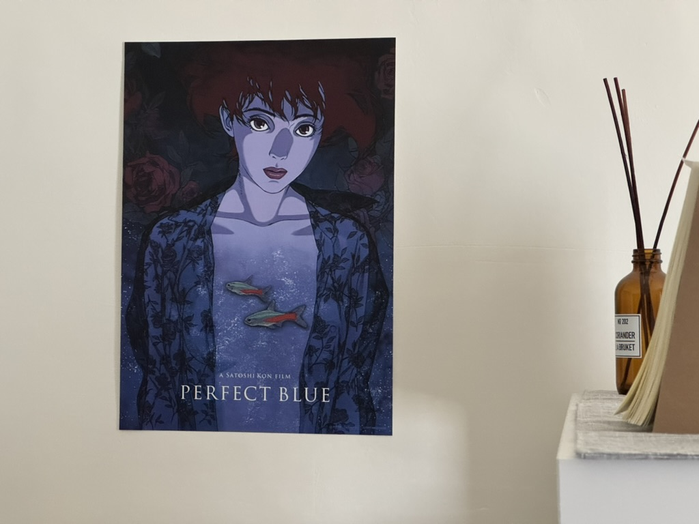
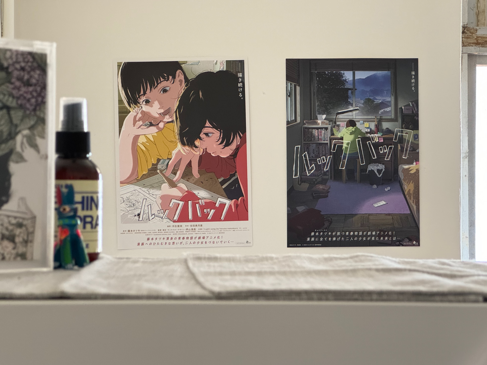

import React from 'react';
import BrowserOnly from '@docusaurus/BrowserOnly';
import Tabs from '@theme/Tabs';
import TabItem from '@theme/TabItem';

<!-- 以上是設定區塊 -->

## 劇與節目

大概是因為覺得自己在學著有大人模樣的心靈之路上磕磕碰碰，近期特別喜歡看帶著人直面現實的失敗和不完美的劇與節目，跟著內容一起哭笑療癒。

現實生活中沒有像連續劇劇情一樣的青梅竹馬可以又打又鬧地相互扶持，也沒有直接對家人戲劇化的順利衝撞和解，但總可以從劇裡的角色中或多或少看到身邊朋友或家人的縮影，觀察到與他人關係中容易忽略但應該好好珍惜的特質，並開啟自我內心對話的多面性。

<!--truncate-->

稍微細想我喜歡的這些劇的共同特質，它們呈現出了人在社會上生存的種種樣態，「想要成功」、「想追逐夢想」、「想要被愛」，裡面的角色抱持著不同的執著在各自的路上跌倒後，在站起來之前發現到在決定要繼續賣力奔跑還是轉彎之前，其實還有一個選項是先坐在地上好好地休息思考「我是誰」、「我想要什麼？為什麼？」

影視娛樂和社交媒體比較傾向展示片面的美好樣態，這些真實的人生課題反而少有聽到人大聲的分享或談論，也因此特別喜歡「心靈燈塔」這個對談節目的安排：  

 **縱使才華洋溢、事業有成，人生會遇到的掙扎和迷茫沒有停止過，有些事會隨著時間、選擇、堅持而改變，但也有些個人特質和思考模式可能到老都會跟隨著我們，而那正是我們獨特的地方。**

:::info 由於自身並不擅長深度的影評，因此在以下清單上附上一些影評連結，有興趣可以參考相關評論
:::

### 愛劇清單

- **[大豆田永久子與三個前夫](https://vocus.cc/article/620e21c0fd8978000159b4bf)**
> 「人生中會遇上失敗，但沒有失敗的人生。」  

> 「人生不是小說或電影，不存在結局好壞、也不存在沒有完成的事，只有怎樣的生活著。」

- **[喜劇開場](https://www.upmedia.mg/news_info.php?Type=196&SerialNo=117755)**
> 「我從沒想到會有這麼一天，我必須告誡自己別付出努力，做出『不要努力比較好』的決定。」

> 「我不打算說什麼『人生就像短劇』這種老掉牙的話，不過等到事過境遷後回顧，會覺得人生就像是齣無聊短劇的話，這樣的人生或許也並不算太差吧。」

- **[精神病房也會迎來清晨](https://guavanthropology.tw/article/7027)**
> 「所有疾病的根源都是失去，失去最珍貴的東西，或者失去了自己，或者失去了幸福的時光。」

> 「我們的生活，都穿梭在日與夜之間，我們都是，往返於正常和反常之間的邊境之民。」

- **[低谷醫生](https://vocus.cc/article/66424503fd897800010a6d7f)**
> 「其實自尊就像是每天堆積起來的小石子，當你懷疑它有沒有意義時，它就會倒塌；相信自己做得到，層層堆積面前的小石子，不知不覺就會變成一棟房子，或是穩固的城堡。」

> 「雖然今天很幸福，明天也可能會忽然變得悲傷，但是沒關係，有悲傷的我就會有幸福的我。我們現在已經有了承受悲傷與不幸的力量，這樣就足夠了。」

- **[媽媽朋友的兒子](https://today.line.me/tw/v2/article/LXjOPZl) (推薦前幾集，後半段更偏向一般愛情劇)**
> 「我的人生就這樣一直全速運轉，中央處理器就停止運作了，畫面也卡住，什麼金鑰都行不通，所以我別無他法，只能讓自己關機重開。」

> 「為什麼我總是得當你的驕傲？我不能單純當你女兒，偶爾有些缺點或瑕疵也沒關係嗎？我為什麼必須被拿來包裝你的人生？」

### 二刷的對談節目

- **[心靈燈塔](https://vocus.cc/article/650590b3fd8978000186789e)**
> 「成為大人之後，壓力也絲毫沒有減少」 ​

> 「自稱謙虛的人反而傲慢，說自己傲慢的人反而謙虛。相同地，強調自己很重視多樣性的人，反而沒有做到這一點。」 ​

> 「不夠強大就無法前往下一個舞台，但變得強大後就無法以同理心待人。」

---

## 瘋狂看電影之旅

開始工作以後，看劇的時間減少了，看電影的頻率卻是大幅的增加。一方面是身在台北又受到朋友影響，開始看影展和更多樣類型的電影；另一方面也是追劇的動力沒以前多了，投入一到三小時的專注力，電影好似對比戲劇給人更濃縮的震撼與思考。

以前一年一隻手數得出看電影的次數，近兩年只算進電影院就每年大概 10 部，真的是十分驚人的增長。除了原本自己喜歡的心理恐怖、懸疑推理類別以外，也開始欣賞一些步調更緩和的電影，可能是引發深入思考的紀實，或是跳脫競爭成就，專注呈現探索、熱愛與日常的角色生活。

### 電影清單

- **[可憐的東西](https://www.marieclaire.com.tw/community/opinion/77621/poor-things)**
> 「我們必須工作，我們必須賺錢，但比這更重要的是，貝拉，我們必須體驗生命中的一切。不僅僅是美好，還有墮落、恐懼、悲傷。這讓我們變得完整，讓我們更有存在價值，而非任性、未被觸碰的孩子。然後我們才能認識這個世界，當我們真正了解了世界，世界就是我們的了。」

- **[我的完美日常](https://medium.com/@asf828310/%E5%BD%B1%E8%A9%95-%E6%88%91%E7%9A%84%E5%AE%8C%E7%BE%8E%E6%97%A5%E5%B8%B8-%E5%93%81%E5%91%B3%E7%94%9F%E6%B4%BB%E6%98%AF%E6%8A%95%E5%85%A5%E6%97%A5%E5%B8%B8%E7%9A%84%E5%B0%8F%E4%BA%8B-758da3a6fced)**
> 「下次是下次，現在是現在。」

> 「這個世界上，其實有很多不同的世界，看起來連在一起實際上並不互通」

- **[怪物](https://vocus.cc/article/64bbd6cafd8978000106487d)**
> 「如果只有部分的人得到，就不能稱作幸福，要所 有的人都能得到，才能稱作幸福。」

- **[奧本海默](https://vocus.cc/article/64e7e255fd897800011804b5)**
> 「你賦予人類自我毀滅的力量，這個世界卻毫無準備」

- **[花月殺手](https://tw.news.yahoo.com/killers-of-the-flower-moon-150913550.html)**
> 「我愛錢幾乎跟我愛我老婆一樣多。」

- **[藍色恐懼 (重映前二刷，重映後再二刷)](https://500times.udn.com/wtimes/story/12672/4773269)**
>「你到底是誰？」

> 「幻想就是幻想，永遠也不可能變成現實。」

- **[驀然回首（二刷）](https://vocus.cc/article/66b8ef13fd89780001d7369b)**
> 「你就看著我的背影，好好前進吧！」

- **[腦筋急轉彎 2](https://crossing.cw.com.tw/article/19013)**
> 「我不知道該如何停止焦慮，或許這就是成長的代價，隨著年齡增長，快樂變得越來越少。」

> 「我們愛你，包括所有凌亂不堪、美麗的部分。」

<!-- 以下是訂閱表單區塊 -->

export const NewsletterForm = () => {
  const [isSuccess, setIsSuccess] = React.useState(false);
  const [isLoading, setIsLoading] = React.useState(false);

  const handleSubmit = async (e) => {
    e.preventDefault();
    setIsLoading(true);

    const formData = new FormData(e.target);
    const email = formData.get('email'); // 更新為新的 email 欄位名稱

    try {
      const response = await fetch(
        'https://buttondown.com/api/emails/embed-subscribe/thinking-today', // 更新為新的 API 端點
        {
          method: 'POST',
          body: formData,
        }
      );

      if (response.ok) {
        setIsSuccess(true);
      }
    } catch (error) {
      console.error('訂閱失敗:', error);
    } finally {
      setIsLoading(false);
    }
  };

  if (isSuccess) {
    return (
      

        <h3 style={{marginBottom: '1rem'}}>感謝訂閱</h3>
        

          只差一步了！請至信箱驗證你的郵件地址。
        

      

    );
  }

  return (
    

      <h3 style={{marginBottom: '1rem'}}>訂閱最新文章</h3>
      

        歡迎使用信箱接收最新文章，或是你也可以
        <a href="/blog/rss.xml">由此訂閱 RSS</a>
      

      
      <form 
        onSubmit={handleSubmit}
        style={{display: 'flex', flexDirection: 'column', gap: '1rem'}}
      >
        <input 
          type="email" 
          name="email" // 更新為新的 email 欄位名稱
          placeholder="輸入你的 Email" 
          required
          style={{
            width: '100%',
            padding: '0.8rem',
            borderRadius: '4px',
            border: '1px solid var(--ifm-color-emphasis-300)',
            backgroundColor: 'var(--ifm-background-color)'
          }}
        />
        <button 
          type="submit" 
          disabled={isLoading}
          style={{
            width: '100%',
            padding: '0.8rem',
            backgroundColor: 'var(--ifm-color-primary)',
            color: 'white',
            border: 'none',
            borderRadius: '4px',
            cursor: isLoading ? 'not-allowed' : 'pointer',
            fontWeight: 'bold',
            opacity: isLoading ? 0.7 : 1
          }}
        >
          {isLoading ? '訂閱中...' : '訂閱'}
        </button>
      </form>
    

  );
};

<BrowserOnly>
{() => <NewsletterForm />}
</BrowserOnly>
