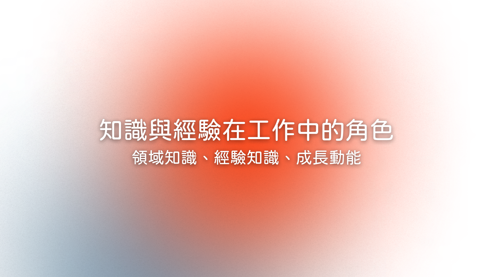
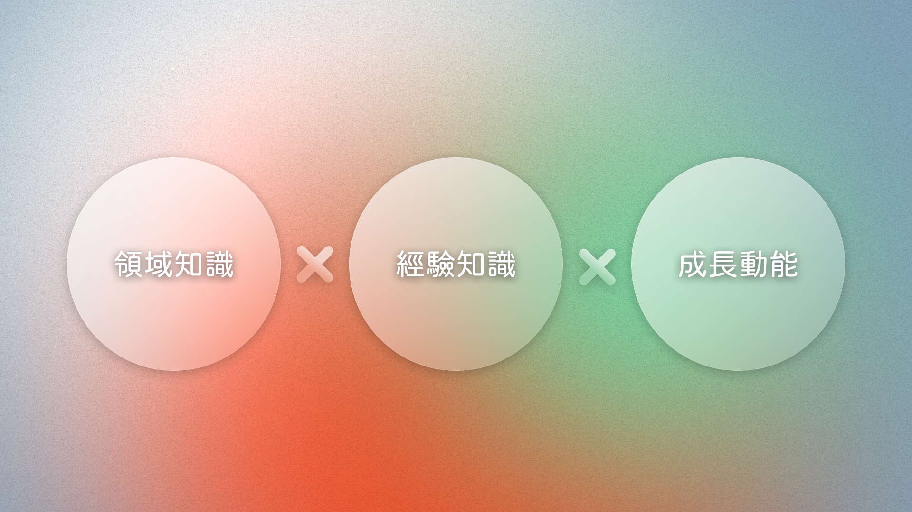
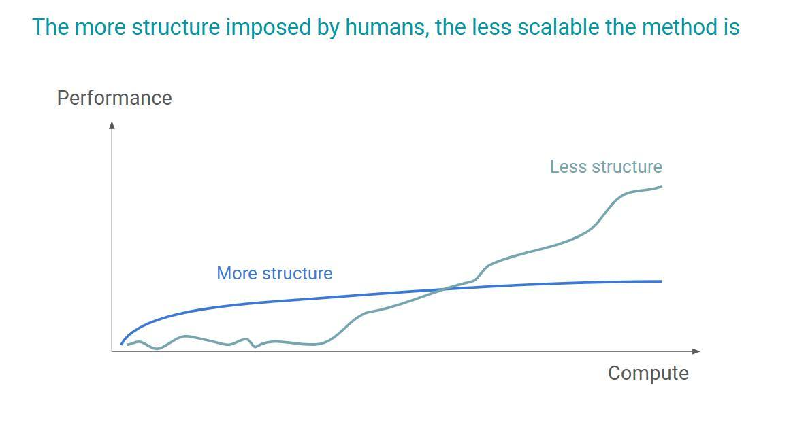

import React from 'react';
import BrowserOnly from '@docusaurus/BrowserOnly';
import Tabs from '@theme/Tabs';
import TabItem from '@theme/TabItem';

<!-- 以上是設定區塊 -->

開始想寫這篇文的契機是最近在 Facebook 看到了一篇[游舒帆撰寫的有趣文章](https://www.facebook.com/100000072259315/posts/pfbid02xc5PJvtfbRB5aNNmxeiiWstss1Gm69RR8LpadSH846Ami5HtEZfCwWuGrmEif4ikl/?d=n)，主旨是從 AI 學習的角度切入，思考對人類更有效學習的方式。看完文章後，我馬上想起近期看到的 [Cursor 小撇步影片](https://www.youtube.com/watch?v=gqUQbjsYZLQ)，也開始聯想到自身的工作經歷，尤其是我一直以來對於 PM 工作中的經驗與知識角色的反思，然後又延伸想到從開始工作到現在我一直會自問跟也很常被其他人問的問題：`不是都說 PM 很需要職場經驗嗎，那為什麼你剛畢業可以當 PM？`

在 PM 工作中，究竟「知識」與「經驗」扮演著什麼角色？這是這篇文想透過一些個人觀點探討的問題。

<!--truncate-->

## 自問自答：經驗真的就那麼重要嗎？

我從準備找工作開始，就不斷地思考經驗到底能為初階職位競爭者帶來多大的差異性。不只是因為和所有新鮮人一樣陷入了沒有經驗就沒有工作、沒有工作就沒有經驗的恐怖漩渦，一開始就鎖定軟體產品經理這個工作也加劇了缺乏經驗對找工作的影響力。

在開始工作後，我觀察了身邊各式各樣的產品經理，想了解經驗到底對這個職位影響力有多大，最後得出的結論卻是如同另一位曾任 PM 職位（註：此篇的 PM 皆是指 Product Manger）的朋友所說：`我覺得大家有點太盲信經驗了。`

會這麼說**並不是認為經驗不重要，而是經驗在每個人身上並不同等重要。**

比如說我曾看過有多年經驗的 PM 特別堅持自己手上產品的理想樣貌，和團隊成員沈浸於打造理想產品卻時程嚴重延宕，讓主管們氣得跳腳；看過由工程師轉職的 PM，因為有過程式實作經驗，會以自己的想法而不是與工程師討論後的做法對外溝通，最後因執行方式和他的想法不同而導致溝通無效；但也看過經驗不深，不裝懂、同步事項明確，讓團隊都十分信賴、自己的能力又快速進步的 PM。

觀察「經驗」在這些人身上起的作用，有些能夠透過累積經驗的過程快速增幅自己的能力值，有些卻反而被過去的經驗阻礙，由此可以看出經驗並不能完全代表一個 PM 的能力，用一個人有多少「經驗」來判斷是否有能力是似乎是一種表面歸因錯誤（Superficial Attribution Error），真正重要的應該是透過經驗形成的「經驗知識」（Experiencial Knowledge）。

## 拆解能力值

所以所謂 PM 的能力值到底來自哪裡？我自己目前會拆解成幾項歸類：領域知識、經驗知識、成長動能。

### 領域知識 vs 經驗知識
#### 領域知識
領域知識泛指在所屬崗位中所需的相關知識，包含常見的產品管理的技術、用戶、商業三大領域，還有各個產業中的特殊知識，像是金融或教育領域的特定需求。

列舉出這些面向好像還是很模糊，如果沒有工作經驗，我能夠擁有這些知識嗎？如果沒進入過該產業、沒有面對過實際的用戶，我要怎麼有相關的知識？

> 我的想法是「領域知識是前人經驗的統整，經驗知識則是自身對於知識的實踐和適配」。

領域知識可以是一些商業模型、一些用戶研究的方法論、一些 Web / App / Desktop 軟體運作的基本概念，也可以是不同產業的商品特性或甚至法規等，可以預先學習的結構性內容。這些結構性內容和所有學校學到的學科一樣，其實來源就是前人的經驗、研究、思考，是一套預先被前人統整好的框架。

#### 經驗知識
而經驗知識，則是在工作經驗（或者說任何非單向輸入的實作形式經驗）中，面對真實問題時，透過篩選、實踐、修正既有認知，最終形成的個人見解。拿專案管理來說，訂定人力和時程、安排優先序是可以依據理論達成規劃的，但如何為團隊預留合適的緩衝時間、怎麼在變動中不斷動態溝通和調整安排，都是需要在過程中不斷優化並累積為自己經驗知識的部分。

領域知識為經驗知識奠定了基礎，幫助我們更快適應新的情境。然而，由前面所舉的 PM 例子來看，多年經驗的理想產品主義者、用自身工程經驗自行推斷實作方法的產品經理，兩者都好像應該已經擁有領域知識和經驗知識，卻未能構成與最後一位相同的備受信賴、快速進步結果，也許是受部分我暫稱之為「成長動能」的其他因素影響。

### 成長動能

除了領域知識和經驗知識，成長動能也是影響 PM 能力的重要因素，我認為這三者共同構成了 PM 的能力模型。

在面對任何新的工作項目或挑戰時，有幾件我認為很重要的事：我多能理解當下的情況、我多想知道背後的原因、我多能想像和接納全新的成功或失敗方式，這幾項分別對應到接下來要提到的**流動智力、好奇心、成長型思維**。

#### 流動智力

在思考對情境的理解能力的時候，我想起過去在課堂學過的「流動智力」這個詞。在心理學家 Cattell 對智力的分類中，人類的認知有兩種智力類型，第一種是「流體智力」（Fluid Intelligence），主要為邏輯推理、彈性思考與解決新問題的能力；第二種則為「晶體智力」（Crystallized Intelligence），主要是運用過去所累積知識庫存的能力。在理論中，晶體智力會隨著年紀 aka 人生經驗增長、流動智力在 20 - 30 歲達到高峰後漸漸下降。

簡言之，流動智力代表我們在面對新問題時的反應和解決能力，比如當你首次接手一個全新領域的項目時，能快速理清邏輯並做出判斷。晶體智力則是你過去經驗中的累積，和經驗知識有很大的關聯性，比如在過去解決過類似問題後，對下一次挑戰更有把握。

針對目前工作上遇到的各種情境，我基於這項理論得到的想法是，在我現在的人生階段，我倚靠的大多是流動智力帶來的反應力與判斷力，並透過這些組織、解決問題的經驗來累積晶體智力。雖然在決策時並不是只能運用其一，但我自認為在這個階段就大幅地使用經驗來做判斷，是不夠安全的做法，因為此時的我經驗不夠多、不夠全面、也未經過多次驗證；也因此，我會時刻提醒自己在累積與運用經驗知識的同時，要保持存疑、隨時修正。

#### 好奇心

流體智力帶來的反應力與判斷力是針對問題的快速處理和概略理解，而如果要更深入了解問題的核心，則需要深掘更多細節，這會需要對問題有足夠的好奇心。比如主管不滿意自己交付的成果時、新發布的功能成效不彰時、抑或是團隊溝通不夠順暢時，都需要反覆地思考跟挖掘為什麼？有哪些因素導致這樣的結果？那用什麼方式能夠帶來何種改變？（如同著名的黃金圈理論 Why - How - What）

#### 成長型思維

而要能創造改變就會需要成長型思維：願意學習新知識、嘗試不同的方法，並且在面對失敗或挫折時保持堅韌和積極的態度。

### 能力值的構成

上述提到的領域知識、經驗知識、成長動能三者相輔相成，形成產品經理的基礎能力值。

經驗知識的初始值可能很低，卻會隨著工作經驗增長，但增長的幅度是會受到領域知識與成長動能影響深度和廣度的。

另一方面，領域知識與成長動能是初期就可以培養出的能力，但沒有隨著工作經驗增長一起增加的話，整體能力值成長幅度也會因此受限。

## 建構能力值

終於要回頭講到一開始提到的文章和影片……

### 從 AI 學習的角度切入，思考對人類更有效學習的方式

`pic from: (第一段所述)游舒帆撰寫的文章`

在游舒帆的文章中，提到了以下幾點：

- 在訓練人工智慧時

    - 高結構性的輸入（知識框架、流程步驟）在早期有效率，但是長期效果差

    - 低結構性的輸入，早期表現差，但後期會有飛躍性提升

    - 在運用低結構性學習方式去完成一個任務的過程，其實他會同步練習到其他能力，例如語言、邏輯、數學，但訓練到的量都很小很小，需要靠大量的累積後才會形成一種能力

    - AI 能在很短的時間內完成非結構化學習，而人類的學習速度很難跟上 AI 

- 因此，他提出了人類適合學習的方式

    - 早期：運用高結構性的方式加速學習

    - 中期：善用低結構性的學習方式來深化學習

    - 後期：盡可能跨領域思考，打破既有框架，建立新框架。  

### 和建構能力值的關聯性

以上和前面討論的能力值建構元素有很大的相似之處，若套入上方提及的時間段區隔：

- 早期：透過結構化學習，快速建立領域知識

- 中期：透過低結構性方法，累積經驗知識，深化學習

- 後期：透過成長動能，擁抱新知、調整自己的認知與行為，突破思考侷限

這邊的早期中期後期並不會是線性的流程，而是可以視為一個循環往復的迭代過程，在累積不同領域知識、實踐、內化的循環裡，提升對不同知識與技能的掌握度。  
另外，應當記得有 `低結構性的輸入，早期表現差，但後期會有飛躍性提升` 這個原則。工作者在開始累積經驗時要有面對初期大量的挫敗與不適應的心理準備，但倚靠自我提升領域知識與成長動能，可以決定整體適應狀況與能力成長的幅度。

### 使用 Cursor：AI 與人類的結構與非結構化學習

很有趣的是在先前提及的這部 Cursor 小撇步介紹影片中，對於用戶和 Cursor 好的合作的方式，提及的方法有幾分關聯性：

- 專案事前目標、流程、畫面規劃 —— 用戶定義出的結構性資料

- 給 Cursor 技術文件、框架概要等 —— 對 AI 來說的結構性資料

- 實際給予草圖、提出要求 —— 對 AI 來說的非結構式情境

- 產出 Code，使用者對內容提問與修改 ——對用戶來說的非結構式經驗

講者主張這對不一定有深入程式能力但想使用 Cursor 開啟專案、學習程式知識的用戶來說是較好的使用方式，可以說是因為在短詩間內給了雙方從結構性到非結構性的學習。

## 小結

### 總而言之

- 只用經驗去判斷一個人的能力是種表面歸因錯誤（Superficial Attribution Error），真正重要的應該是透過經驗形成的「經驗知識」（Experiencial Knowledge）

- 能力值的構成：領域知識 x 經驗知識 x 成長動能

- 先建立結構化的領域知識，再透過實際經歷獲取經驗知識，並藉由成長動能放大加乘效果，是能力值增長的方式

### 所以，沒有工作經驗可以當產品經理嗎？

回應第一段遇到的這個問題，總結來說，我認為要成為一名 PM，不能僅依賴經驗，而是需要在領域知識、經驗知識和成長動能之間取得平衡。所以，對於那個經常被問到的問題——『沒有經驗能當 PM 嗎？』我的答案是，若能擁有基本領域知識、足夠的成長動能、一點點小型專案而來的經驗知識，是可以的。

和從其他職位轉職同理，前提都是你能從其他地方累積到你進入的職位所要求的基礎能力值，比如對用戶研究方法的理解和實際專案經驗等。我身邊也有不少朋友一樣是透過在大學／研究所時期累積的軟體相關專案、實習、研究經驗，一出社會就擔任 PM 這項職位。

當然，以上探討僅限縮於我自身處在的 IC、相對 Junior 的職位，其他更高階的職位不在這裡的討論範圍。

---

## 參考資料

- 體驗知識

    - [Wikipedia - Experiential Knowledge](https://en.wikipedia.org/wiki/Experiential_knowledge)

    - [What is Experiential Knowledge?](https://peertac.org/2023/10/05/what-is-experiential-knowledge/)

    - [Experiential learning: A must for product managers and leaders](https://theprodzen.com/experiential-learning-a-must-for-product-managers-and-leaders/)

- 流動智力 / 固定智力

    - [流體智力與晶體智力](https://vocus.cc/article/65d0bb81fd89780001301ebb)

    - [流體智力（fluid intelligence）vs. 晶體智力 （crystallized intelligence）](https://psychmemorandum.blogspot.com/2021/12/fluid-crystallized-intelligence.html)

- 成長型思維

    - [成長型思維模式的教育新趨勢](https://epaper.naer.edu.tw/edm.php?grp_no=3&edm_no=170&content_no=2989)

## 推薦閱讀

- 若對如何成為（軟體）產品經理感興趣

    - Samuel - [如何從零開始成為一位產品經理（Product Manager）？ ](https://medium.com/@citysite1025/%E5%A6%82%E4%BD%95%E6%88%90%E7%82%BA%E4%B8%80%E4%BD%8D%E7%94%A2%E5%93%81%E7%B6%93%E7%90%86-product-manager-80f8234389f6)

    - Charles - [不好意思我們需要更有經驗的人選—關於第一份工作如何成為軟體產業產品經理 Software Product Manager](https://medium.com/charles-tseng/%E4%B8%8D%E5%A5%BD%E6%84%8F%E6%80%9D%E6%88%91%E5%80%91%E9%9C%80%E8%A6%81%E6%9B%B4%E6%9C%89%E7%B6%93%E9%A9%97%E7%9A%84%E4%BA%BA%E9%81%B8-%E9%97%9C%E6%96%BC%E7%AC%AC%E4%B8%80%E4%BB%BD%E5%B7%A5%E4%BD%9C%E5%A6%82%E4%BD%95%E6%88%90%E7%82%BA%E8%BB%9F%E9%AB%94%E7%94%A2%E6%A5%AD%E7%94%A2%E5%93%81%E7%B6%93%E7%90%86-software-product-manager-978e1c7120f4)

- 若想知道更細節和更深入的 PM 相關能力

    - Peter Su - [產品經理如何成長？](https://medium.com/3pm-lab/%E7%94%A2%E5%93%81%E7%B6%93%E7%90%86%E5%A6%82%E4%BD%95%E6%88%90%E9%95%B7-1c2c7979f5af)

    - 產品經理喬 PM Joe - [PM (Product Manager) 產品經理要具備什麼能力？什麼是產品經理？](https://medium.com/@ohjoe86/pm-product-manager-%E7%94%A2%E5%93%81%E7%B6%93%E7%90%86%E8%A6%81%E5%85%B7%E5%82%99%E4%BB%80%E9%BA%BC%E8%83%BD%E5%8A%9B-%E4%BB%80%E9%BA%BC%E6%98%AF%E7%94%A2%E5%93%81%E7%B6%93%E7%90%86-a6a564ec53ca)

<!-- 以下是訂閱表單區塊 -->

export const NewsletterForm = () => {
  const [isSuccess, setIsSuccess] = React.useState(false);
  const [isLoading, setIsLoading] = React.useState(false);

  const handleSubmit = async (e) => {
    e.preventDefault();
    setIsLoading(true);

    const formData = new FormData(e.target);
    const email = formData.get('email'); // 更新為新的 email 欄位名稱

    try {
      const response = await fetch(
        'https://buttondown.com/api/emails/embed-subscribe/thinking-today', // 更新為新的 API 端點
        {
          method: 'POST',
          body: formData,
        }
      );

      if (response.ok) {
        setIsSuccess(true);
      }
    } catch (error) {
      console.error('訂閱失敗:', error);
    } finally {
      setIsLoading(false);
    }
  };

  if (isSuccess) {
    return (
      

        <h3 style={{marginBottom: '1rem'}}>感謝訂閱</h3>
        

          只差一步了！請至信箱驗證你的郵件地址。
        

      

    );
  }

  return (
    

      <h3 style={{marginBottom: '1rem'}}>訂閱最新文章</h3>
      

        歡迎使用信箱接收最新文章，或是你也可以
        <a href="/blog/rss.xml">由此訂閱 RSS</a>
      

      
      <form 
        onSubmit={handleSubmit}
        style={{display: 'flex', flexDirection: 'column', gap: '1rem'}}
      >
        <input 
          type="email" 
          name="email" // 更新為新的 email 欄位名稱
          placeholder="輸入你的 Email" 
          required
          style={{
            width: '100%',
            padding: '0.8rem',
            borderRadius: '4px',
            border: '1px solid var(--ifm-color-emphasis-300)',
            backgroundColor: 'var(--ifm-background-color)'
          }}
        />
        <button 
          type="submit" 
          disabled={isLoading}
          style={{
            width: '100%',
            padding: '0.8rem',
            backgroundColor: 'var(--ifm-color-primary)',
            color: 'white',
            border: 'none',
            borderRadius: '4px',
            cursor: isLoading ? 'not-allowed' : 'pointer',
            fontWeight: 'bold',
            opacity: isLoading ? 0.7 : 1
          }}
        >
          {isLoading ? '訂閱中...' : '訂閱'}
        </button>
      </form>
    

  );
};

<BrowserOnly>
{() => <NewsletterForm />}
</BrowserOnly>
