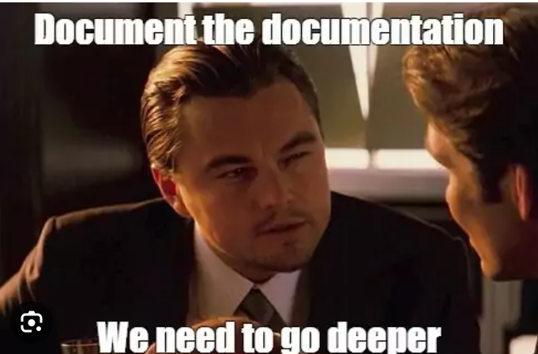
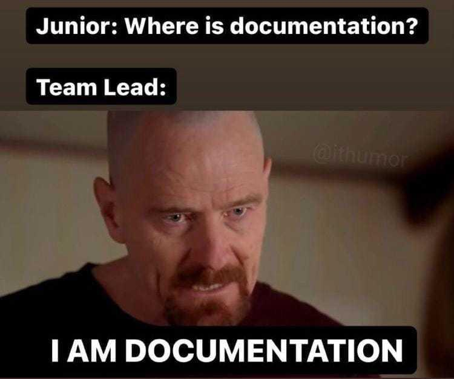
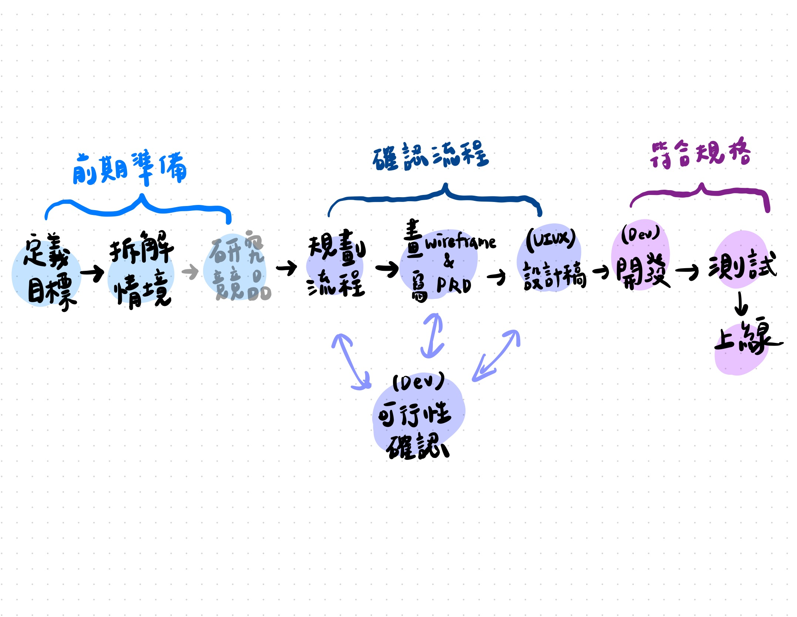
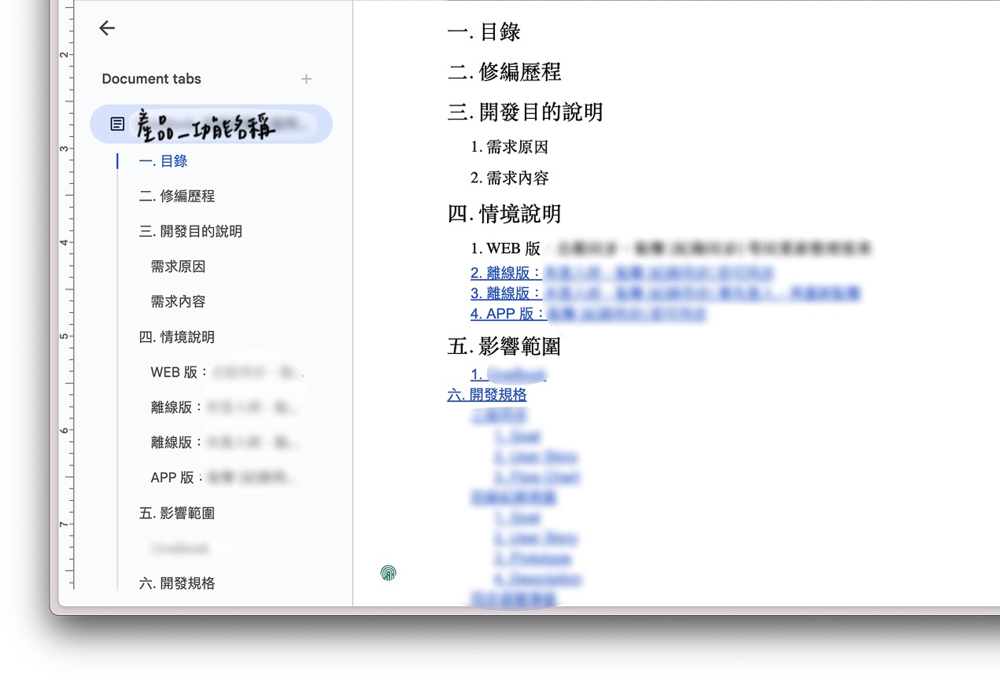
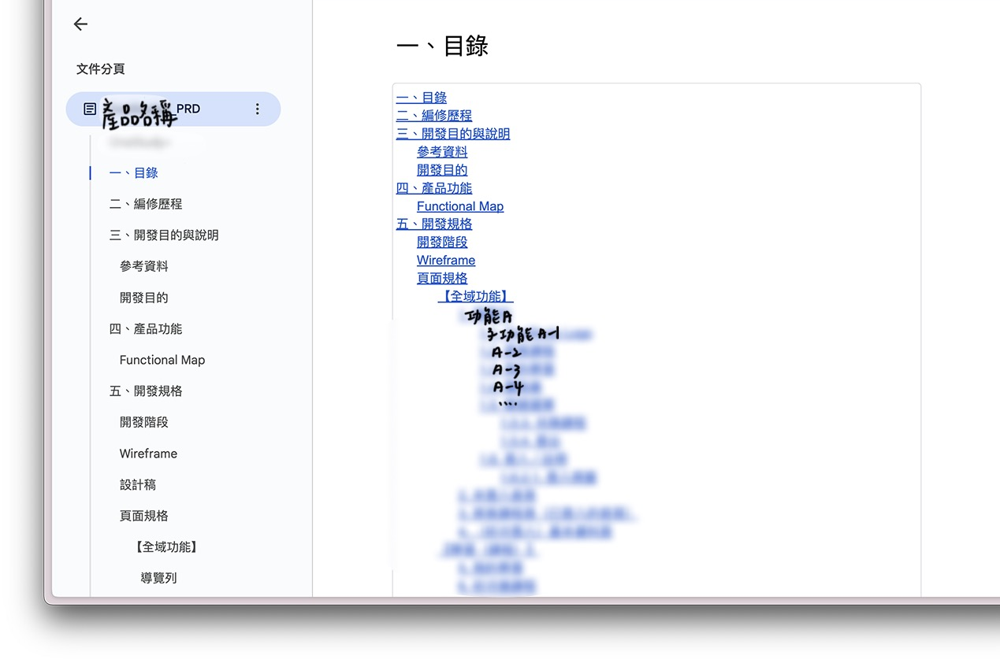
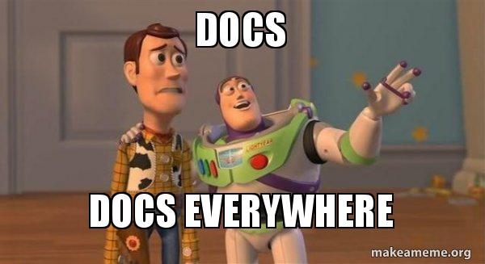
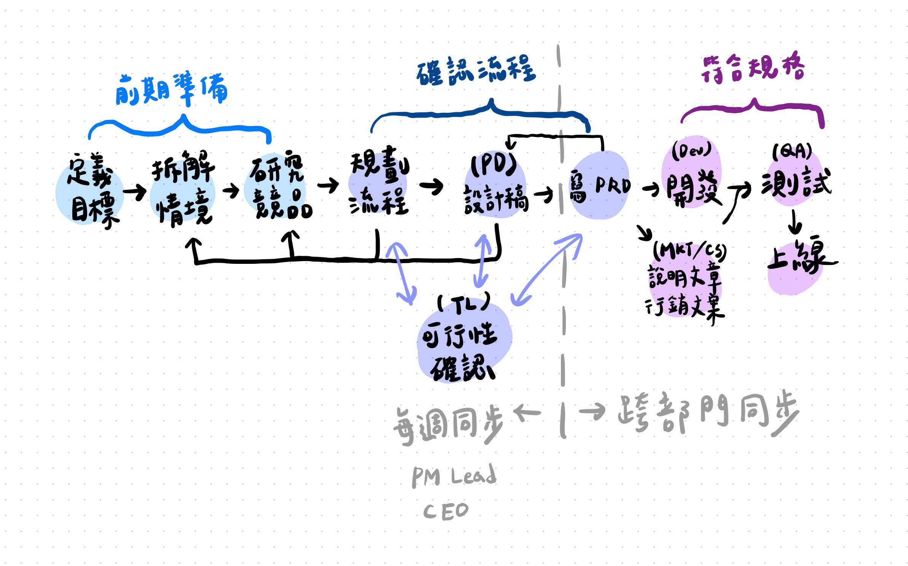
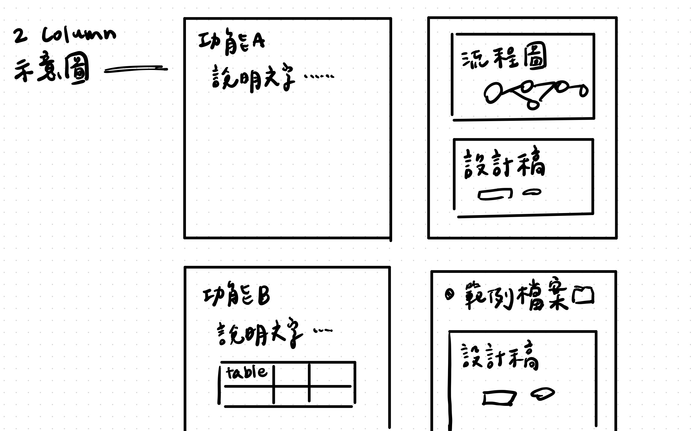

import React from 'react';
import BrowserOnly from '@docusaurus/BrowserOnly';
import Tabs from '@theme/Tabs';
import TabItem from '@theme/TabItem';

<!-- 以上是設定區塊 -->

作為產品經理要經手的文件百百種，但要說花費最多時間撰寫與維護的，PRD 難以逃脫第一名，對我來說日常工作不是在研究、會議、更版，就是在寫 PRD 的路上。

PRD 的形式與管理方式，往往隨著團隊規模、產品發展階段而改變。在前一間公司，我從零建立 PRD，摸索適合團隊的文件管理方式；而現在的公司，產品已有八年歷史，文件存放分散，需要重新整理並轉移至新系統。在這些過程中，我發現 PRD 並不是靜態的，而是隨著產品架構、團隊需求進化，這篇文章是記錄我工作兩年來經歷過的演進歷程。

<!-- truncate -->

## 何謂 PRD

產品需求文件（Product Requirement Document, PRD）是一個詳盡的產品指南，精確地描述產品需求，用來達到降低溝通阻力、增加管理效率的目標。

根據這篇 [How to Write the Best PRD For Product Managers?](https://shailesh-sharma.medium.com/how-to-write-the-best-prd-for-product-managers-5987c4863b8c)，好的 PRD 應該有以下特性：
- 在平易近人與技術的文字間平衡
- 不會變成遠古文物而是會持續動態調整 
- 不只是列出功能，也講述用戶從功能受益的情境

寫文件一定沒有口頭溝通快，但一定會比起口頭溝通來得準確。為團隊建立起更統一的情境認知、更一致的功能細節規範，是我認為 PRD 的核心功能。

## 🥚 Phase I：從零開始建立產品文件

前主管的作風是不寫文件，跟設計師和工程師口頭溝通好情境就好，但我有著不紀錄下來就不踏實的病，於是依循著實習時期的經驗、網路上的資料，發展出一套跟設計與工程的文件溝通流程。

### 規劃流程

當時負責三個產品線，兩個沒有先前的文件、一個是從 0 到 1 的產品，在我對功能細節有大部分掌控權的情況下，規劃流程偏單純：

1. 確認需求
2. 進行競品研究（optional）和規劃
3. 完成規格
4. 依據改動幅度決定要不要畫 Wireframe
5. 開單請設計師出設計稿
6. 依據討論後定稿的設計微調規格再進入開發
7. 最終在我根據規格驗收完功能後上線

### PRD

因應面對的需求大小，撰寫規格的方式會依照以下做微調：

#### 小型功能

直接在 Jira 開單，單內附上以下資訊：
- User Story
- 流程圖／Wireframe／設計稿（若已跟設計師確認完稿）
- 開發規格：行為流程、頁面功能、欄位限制

#### 中大型功能

使用 Google docs 撰寫文件，視需求可能拆分成多張單給工程與設計。每份文件會包含以下項目：
- 目錄
- 編修歷程
- 開發目的說明
  - 需求來源
  - 需求內容
- 情境說明
  - User stories 
- 影響範圍
  - 影響的產品（可能跨產品）
  - 影響的裝置（產品各自有 Web / Desktop / Mobile 版本）
  - 影響的頁面、流程
- 開發規格

#### 0 - 1 產品

使用 Google docs 撰寫文件，將產品功能依照產品架構分類，並且拆分開發階段：
- 目錄
- 編修歷程
- 開發目的與說明
- 產品功能
  - Functional Map
- 開發規格
  - 開發階段
  - 頁面規格（Wireframe 和流程圖穿插其中）
    - 【前台】
      -【全域功能】
      - 【主要頁面／功能分類】
    - 【後台】
      - 【全域功能】
      - 【主要頁面／功能分類】
    - 【權限統整】
      - 前台權限
      - 後台權限
    - 附錄
      - 使用者條款等產品所需附件檔案

### 檢討

回頭來看這些文件內容雖有達到在當下促進團隊溝通的目的，但仍有許多須改進之處：

1. **可維護性**較低：

  - 文件的存放：文件過於分散（同產品不同功能散落多個文件／單）或過於集中（0 - 1 產品的所有功能在一個不好變動的線性文件裡）

  - 版本管理：雖然有記錄編修歷程，但由於 Google Docs 的編輯紀錄是較細的時間戳記，難以回溯到特定版本，並且仰賴我手動新增歷程紀錄

2. **細節格式**不統一：由於是每次改動見招拆招，慢慢形塑 PRD 架構，所以除了必定有的 User Story 跟頁面行為說明外，其他細節會視每次跟設計與工程討論的狀況優化，並且面對隕石可能就會有急著開單脫離原本架構的情況發生。

:::note Phase I 小結

- 沒有文件 → 建立 PRD 讓團隊有文件可參考
- 使用 Jira Issue、Google Docs 存放文件 → 文件存放過於分散、缺乏明確的版本管理，導致後續維護文件成本高
- 視情境、功能大小彈性調整格式 → 文件格式不統一
:::

## 🐣 Phase II：模組化與標準化

而在現在的公司中雖有寫規格的習慣，但過往曾使用過 Google Slides、Google Docs、GitLab 幾種方式管理，並且不是所有功能都有記錄。

在我進入公司時，比較近期的功能已轉用 Confluence 存放產品文件，但無論是優化舊功能還是開發新功能，大部分的文件還是需要從頭撰寫。

### 規劃流程

規劃流程大同小異，主要的改變是前期研究從我自作主張地做（？），變成必定會經過的流程，且和產品設計師大量合作執行。此外，寫 PRD 以前，規劃過程與細節每週都會和主管與老闆同步，並在上線前有和行銷 / 客服／業務等更多跨職能角色合作：
1. 確認需求
2. 進行競品研究
3. （與上層）同步流程、設計稿，依據討論調整
4. （與 Tech Lead）可行性來回確認
5. 完成規格，期間補足或修改設計細節
6. 跨部門同步，，依據討論調整
7. 經過 Tech Lead 評估做法後的規格進入開發
8. Marketing / CS 進行相關文件與推廣規劃
9. 手動＋自動化測試
10. 上線

### PRD

相比於 Phase I 整理出的文件格式，Phase II 的產品文件管理方式更動態地在迭代，因此以下不列詳細的文件內容，而是整理目前管理的準則。

#### 統整 PRD 與設計稿架構

剛好在調整 PRD 分類方式時，設計師也想整理 Figma 設計稿，於是我們一起討論出了統一的分類架構，讓 PRD 與設計稿可以有更一致的分類，幫助查找與減少重複性。基本上遵循以下大原則：

- 依照**產品的架構**做外層分類：比如後台總覽、帳戶設定
- 依照**流程**做下層分類：比如編輯題目、分享問卷、查看問卷結果是一個完整的編輯問卷流程
- **重複性的功能**集中為一個分類：比如產品內很多地方都可以上傳圖片但可能有不同限制

#### 根據功能特性，製作並持續維護模板

當整理產品規格一段時間，除了 User Story、流程圖、規格說明、設計稿對應方式這些大方向可以統一以外，觀察並分類出規格模板，有助於**降低從頭建立文件的力氣、避免遺漏細節，以及統一團隊的文件溝通方式**。我自己目前歸類的方式如下：

- 常見且有**重複複雜因素**要考慮的功能  
比如一個新的問卷題型，每次設計都至少需要考慮以下面向，這些面向底下要確認的內容就會被條列並納入新題型模板中：  
  -  權限：題型本身或是內部設定適用的方案、團隊角色  
  -  編輯時可以進行的 N 種設定：包含跨題型通用的基礎設定及該題型特定的設定  
  -  統計圖表：該題型適用的圖表呈現  
  -  明細匯出：該題型的資料格式，在後台有提供的三種格式 x 三種檔案類型下，介面與匯出的檔案分別如何呈現  
  -  邏輯設定方式  

- 常見且有**特定規則**需要遵循的功能  
比如功能 Config，不像題型有那麼多複雜細節需要考慮，但通常都需要定義 Key name、預設值、設定值等

- 一般新功能  
以上兩類以外的任何新功能都可以通用的基本內容

#### 讓文件可追溯、好查找、標示明確

- 可追溯  
由於目前使用的 Confluence 內建有明確的版本管理功能，我只要在發佈變更前備註該次做了什麼改動，後續都可以直接查看和回復到特定改動之前。

- 好查找  
這裡的查找是指查找和該功能相關的資訊。在所有模板裡我都會放上需求文件、研究文件、設計稿、Jira 單等連結欄位，方便放上相關資料連結，讓其他人或我自己在必要時查看。

- 標示明確
  - 文字與圖像的對應  
  團隊內現行的規格模板通常是左右欄的形式，多虧 Confluence 的內嵌功能，除了放上整份設計稿的連結，我可以讓 Figma 的特定 Frame 預覽顯示在文字敘述旁，FigJam 畫的流程圖也同理。
  
  - 習慣／養成團隊對特定標示涵義的共識  
  比如大括號內的文字是變數、文字內容使用 `code 底` 等。
  - 若是更動舊規格，前後改動差異需要被明確指出

### 檢討

- **同步角色**過於侷限：
  - 目前的內容還是著重在產品開發團隊的內部同步，上線前推廣計劃等和行銷 / 客服／業務跨職能的協作都是額外拉出來同步，在改組後各角色更密切合作的狀況下，也許有更好整合、減少重工的做法
  - 我們公司沒有 MRD，考慮納入相關的文件架構到現有文件是一種可能方式

- **驗收標準**不夠嚴謹：
  - 去年一整年大多在做 B 端的功能，一直在趕時限 GA 埋點的單都是後補，今年拆分部門後，面向 C 端需要有更完善的數據監測
  - 規劃時應該就要列 DoDs，第一階段測試有更明確的基準點，可以幫助 QA 後續更好延續測（ㄋㄨㄥˋ）試（ㄏㄨㄞˋ）

- **極端情境的盤點**不夠完善：雖然覺得這件事始終難以避免，從規劃、寫規格到開發，一直都會需要有各種遺漏的情境或技術限制需要討論，但現在並沒有發展出一套可以有效幫助自己或團隊檢查的方式，非常仰賴每次的感覺。最近開始會讓 AI 幫助羅列情境，成效還在觀察中。

:::note Phase II 小結

- 與設計師同步，統一 PRD 與 Figma 設計稿的分類方式，提升查找與維護效率
- 建立 PRD 模板，針對常見功能標準化撰寫方式，降低遺漏風險
- 善用 Confluence 的版本管理紀錄，讓文件更可追溯
:::

## 🐥 Next Phase & 結語

過去兩階段都是非常專注在產品開發團隊內部的溝通，而當基礎的架構建設完成並運行順利後，下一步需要的是從更全面的市場策略、驗證機制著手，和更多角色同步認知。

PRD 是一種動態的溝通工具，它的價值取決於是否能幫助團隊建立共識並提升開發效率；它需要從個人管理走向團隊協作，從功能描述發展成可追蹤、可驗證的文件系統。

說起來可能有點奇怪，但很多時候我頗樂在整理和撰寫文件的過程中 ~~（雖然可以好好寫的時間難能可貴）~~，把功能具體定義出來、梳理和打磨其中細節，跟規劃階段有著不同的樂趣。

不知道看到這的大家，公司內部都是怎麼寫 PRD 的呢？歡迎跟我分享！

## 推薦閱讀

### 關於如何寫 PRD

- [How to Write the Best PRD For Product Managers?](https://shailesh-sharma.medium.com/how-to-write-the-best-prd-for-product-managers-5987c4863b8c)
- [Decoding Success: A Guide to Writing Effective PRD](https://medium.com/design-bootcamp/decoding-success-a-guide-to-writing-effective-prd-683c55799198)
- [【SOP不藏私】系列＃EP1「連猴子也會的PRD指南」](https://medium.com/as-a-product-designer/sop-ep01-prd-3c6d33880c34)

### 延伸推薦
- [A framework for PM skill development | Vikrama Dhiman (Gojek)](https://www.lennysnewsletter.com/p/a-framework-for-pm-skill-development?publication_id=10845&post_id=144374892&isFreemail=true&r=3h70ns&triedRedirect=true)
> Good PMs produce good artifacts: PRDs, product notes, design briefs, etc. These demonstrate your proficiency across core PM skills, and they are your opportunity to “have impact on the impact”—to add value to a team that is adding value to the company.

<!-- 以下是訂閱表單區塊 -->

export const NewsletterForm = () => {
  const [isSuccess, setIsSuccess] = React.useState(false);
  const [isLoading, setIsLoading] = React.useState(false);

  const handleSubmit = async (e) => {
    e.preventDefault();
    setIsLoading(true);

    const formData = new FormData(e.target);
    const email = formData.get('email'); // 更新為新的 email 欄位名稱

    try {
      const response = await fetch(
        'https://buttondown.com/api/emails/embed-subscribe/thinking-today', // 更新為新的 API 端點
        {
          method: 'POST',
          body: formData,
        }
      );

      if (response.ok) {
        setIsSuccess(true);
      }
    } catch (error) {
      console.error('訂閱失敗:', error);
    } finally {
      setIsLoading(false);
    }
  };

  if (isSuccess) {
    return (
      

        <h3 style={{marginBottom: '1rem'}}>感謝訂閱</h3>
        

          只差一步了！請至信箱驗證你的郵件地址。
        

      

    );
  }

  return (
    

      <h3 style={{marginBottom: '1rem'}}>訂閱最新文章</h3>
      

        歡迎使用信箱接收最新文章，或是你也可以
        <a href="/blog/rss.xml">由此訂閱 RSS</a>
      

      
      <form 
        onSubmit={handleSubmit}
        style={{display: 'flex', flexDirection: 'column', gap: '1rem'}}
      >
        <input 
          type="email" 
          name="email" // 更新為新的 email 欄位名稱
          placeholder="輸入你的 Email" 
          required
          style={{
            width: '100%',
            padding: '0.8rem',
            borderRadius: '4px',
            border: '1px solid var(--ifm-color-emphasis-300)',
            backgroundColor: 'var(--ifm-background-color)'
          }}
        />
        <button 
          type="submit" 
          disabled={isLoading}
          style={{
            width: '100%',
            padding: '0.8rem',
            backgroundColor: 'var(--ifm-color-primary)',
            color: 'white',
            border: 'none',
            borderRadius: '4px',
            cursor: isLoading ? 'not-allowed' : 'pointer',
            fontWeight: 'bold',
            opacity: isLoading ? 0.7 : 1
          }}
        >
          {isLoading ? '訂閱中...' : '訂閱'}
        </button>
      </form>
    

  );
};

<BrowserOnly>
{() => <NewsletterForm />}
</BrowserOnly>
