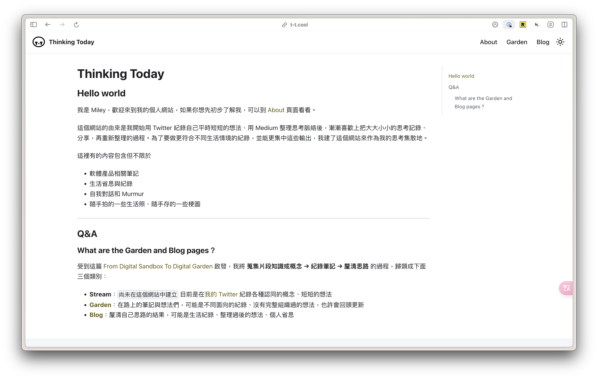
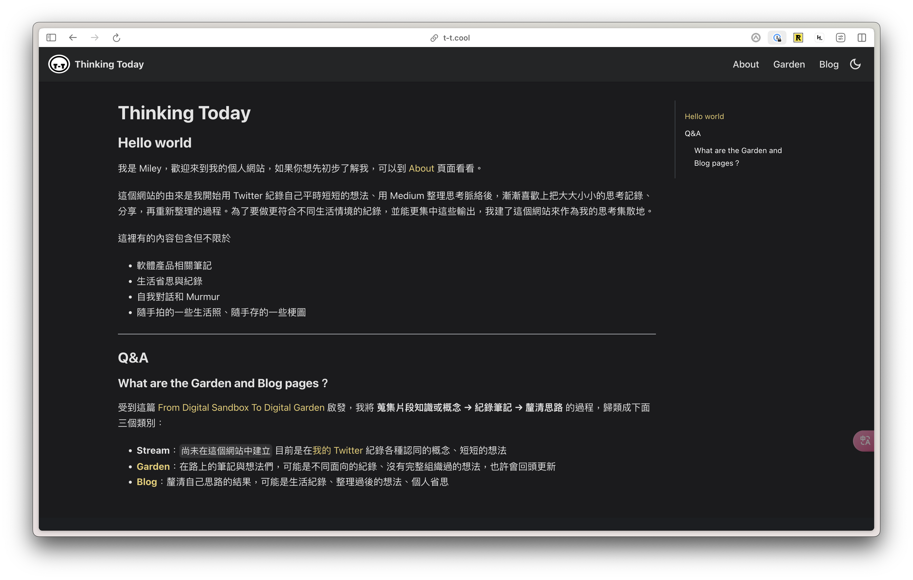

`Release date: 2024/07/04`

## 改動項目
- 網站上線！
- 將 [Medium](https://medium.com/@MileyChen) 的文章搬過來了

## 改動說明

### Logo

大概從高中開始就是用英文名字出外闖蕩，連親近的朋友都是叫我英文名字的中文音譯比較多，但在思考可以代表自己的 Logo 的時候希望可以再更多私人的成分，所以選擇用中文名字的縮寫 T-T。

被朋友說沒看過有人的 Logo 看起來這麼慘 🤣，但我卻覺得很能代表我容易 emo 的個性、常常聚集滿滿感性的反思紀錄。

### 網站配色

過去個人作品集網站（已年久失修）、Bento 頁面的配色以黃色與棕色為主，目的是想增加一點點活潑又不失沈穩的感覺。

這次網站沿用相近色系，在深色模式使用黃色、淺色模式使用黃褐色。

## Snapshot

