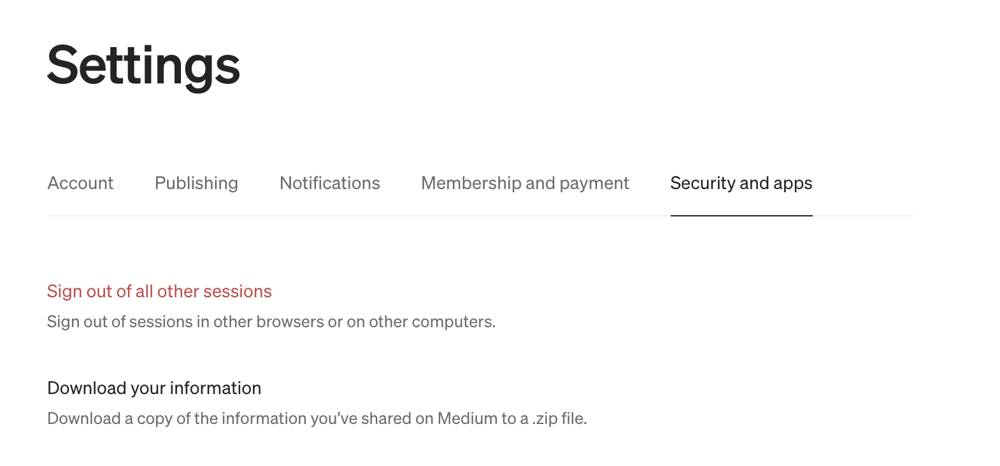
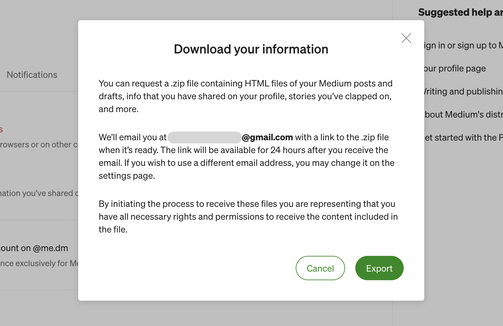
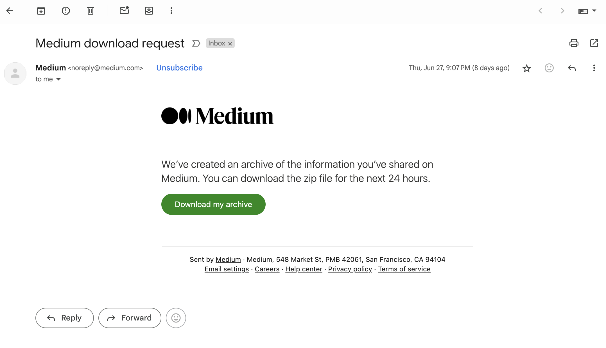
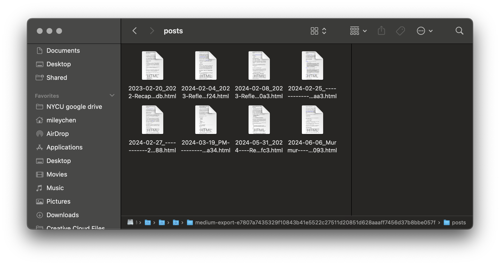
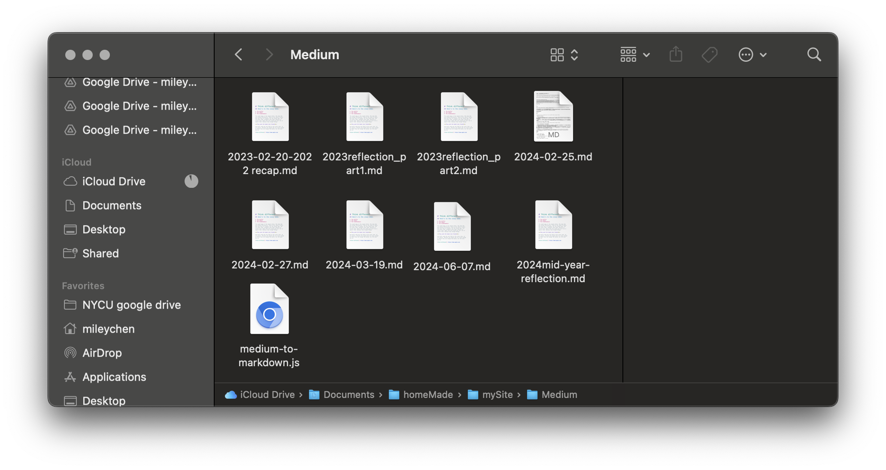

## TL;DR
在架設這個網站的時候，想把在 Medium 的文章搬過來，但覺得一篇篇複製很麻煩，所以開始找可以匯出的方法。

官方只能匯出 html 檔的緣故，花了一陣子找到可以匯出 Markdown 檔的方法，實際成功以後發現並不會很難，但大概是因為跟技術文件太不熟，看著教學也試了好久才成功，於是來寫下自己的 step by step 白話文做紀錄。

## Medium 後台匯出 html 檔

最一開始是直接到後台嘗試匯出文章，最終發現得到的文章格式會是 .html。

### 1. 進入設定頁
:::note 路徑：右上 drop down > `Settings` > `Security and apps`
:::

- 在 `Security and apps` 裡可以看到 `Download your information`



### 2. 確認匯出
- 點擊 `Download your information` 後會跳出匯出的說明 Modal
- 點擊 `Export` ，會需要等待一段時間才會收到 zip 檔



### 3. 下載檔案
- 收到信件後，點擊 `Download my archive` 即可下載壓縮檔



### 4. 得到 html 檔
- 下載並解壓縮後，進到 `posts` 資料夾，裡面就會有全部文章的 html 檔



## 匯出 markdown 檔
以下步驟是參考[這篇教學文章：Converting Medium Posts to Markdown for Your Blog](https://medium.com/towards-data-science/converting-medium-posts-to-markdown-for-your-blog-5d6830408467)
### 1. 安裝 [Medium to Markdown](https://www.npmjs.com/package/medium-to-markdown?activeTab=readme)
:::warning 先確定電腦已有安裝 npm
:::
- 開啟 Terminal，進入你想存放匯出 script 跟文章的資料夾

```
cd {你要進入的資料夾}/{可以多層}
```

- 輸入以下指令

```
npm i medium-to-markdown
```

- 這時應該會在你所在的資料夾出現一個 Javascript 檔，這是匯出時背後運行的 script

```
const mediumToMarkdown = require('medium-to-markdown');
 
// Enter url here
mediumToMarkdown.convertFromUrl('<medium post url>')
.then(function (markdown) {
  console.log(markdown); //=> Markdown content of medium post
});
```

### 2. 匯出指定文章
這是我摸索很久的一步 QQ，從上方 Medium to markdown 的說明裡來看，應該是只要下指令就好，但這個指令我一直無法成功：

```
npm run convert {你要匯出的文章的 url}
```

於是我參考上方提到的教學文章，用**修改 js 檔**跟**下指令**兩個步驟來完成匯出。

#### 修改 js 檔
- 替換掉檔案裡的 `<medium post url>` 為要匯出的文章連結
:::warning 記得保留外層單引號
:::
- 以我要匯出[這篇文章](https://medium.com/@MileyChen/murmur-%E5%B9%B3%E5%BA%B8%E4%B9%8B%E4%B8%8A%E7%9A%84%E5%B9%B3%E5%87%A1%E4%BA%BA-ddbf079c8093)為例，替換後的檔案會長下面這樣

```
const mediumToMarkdown = require('medium-to-markdown');
 
// Enter url here
mediumToMarkdown.convertFromUrl('https://medium.com/@MileyChen/murmur-%E5%B9%B3%E5%BA%B8%E4%B9%8B%E4%B8%8A%E7%9A%84%E5%B9%B3%E5%87%A1%E4%BA%BA-ddbf079c8093')
.then(function (markdown) {
  console.log(markdown); //=> Markdown content of medium post
});
```

#### 下指令
- 更改完檔案後，回到 Terminal 下以下指令
:::warning 記得確認 Terminal 路徑有在 js 檔相同的資料夾裡
:::

```
node medium-to-markdown.js >> {你要的檔案名稱}.md
```

- 然後檔案就會匯出到所在的資料夾裡了！
- 匯出多篇要重複以上兩個步驟，還好架站時在 Medium 還沒有很多文章

