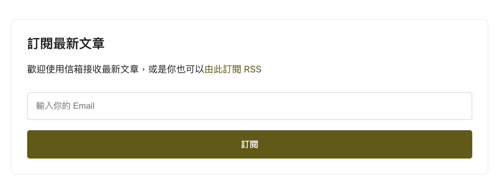
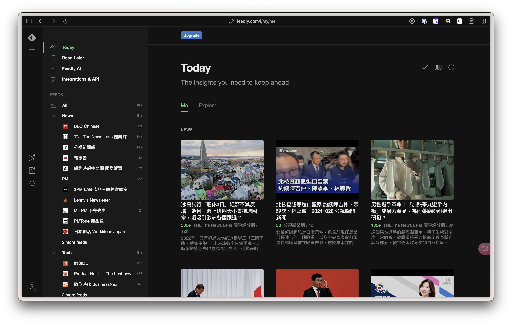
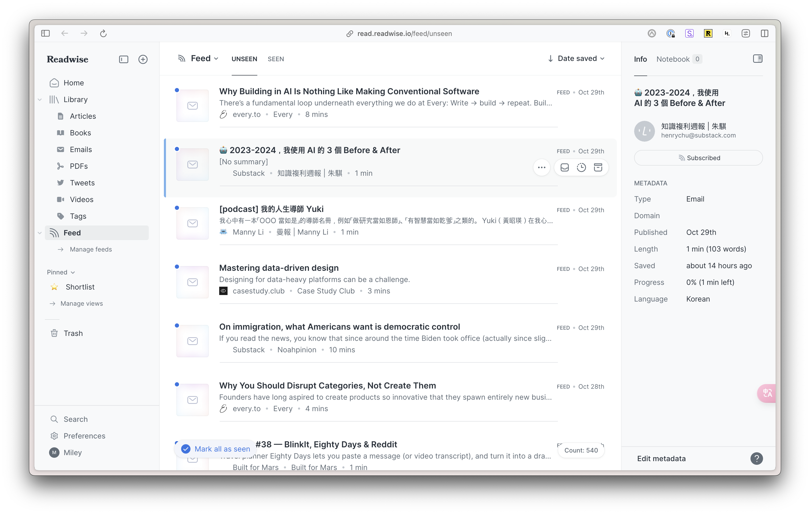

## TL;DR
我自己有訂閱並集中管理我想看的資訊的習慣，所以覺得網站如果能夠有管道即時地推播新文章，對讀者來說是一個蠻大的加分功能。  

雖然這個網站的 Blog 內容和流量都還不是很多，但反正剛好看到 Docusaurus 的 RSS 功能，就試著調整 config 開啟了 RSS 頁面。（~~非常隨便~~）

調整完 RSS 後，我接著突發奇想了起來：`比起 RSS，我現在好像更常使用 Email 訂閱，也有一些部落格有提供 Email 訂閱的機制，不知道我自己能不能夠做到把 RSS 轉成 Email 訂閱，連動更新？`  

於是我的研究與探索之旅就這樣開始了，這篇是過程中的一些筆記。

## RSS 訂閱機制

### 什麼是 RSS？
> RSS的英文全稱是Really Simple Syndication，是一種透過XML(eXtensible Markup Language)特性所制定的格式，讓網站的管理者可以把網頁內容傳給訂閱戶。

> RSS只是一個格式，使用者想要訂閱各網站所提供的內容還需要一個閱讀器(Reader)。

### Pros & Cons
RSS 是個很方便的機制，不過需要額外使用閱讀器是個雙面刃：
- 優點：訂閱的網站可以完全掌握自己的內容，不會有插入廣告或影響使用者體驗的問題
- 缺點：對於沒有習慣使用閱讀器的人來說，會不太知道該怎麼訂閱

### 我自己的使用經驗
我自己是幾年前家人介紹，才知道有像 [Feedly](https://feedly.com/) 這樣的閱讀器。  
在資訊爆炸的現在，我認為有個集中管理的工具是為自己掌控資訊品質的好方法，因此後來曾嘗試使用過一段時間。  
但漸漸地，我發現並不是所有我想看的網站都有提供 RSS，且如果大部分是訂閱新聞網，Feed 太容易被龐雜但我不一定有興趣的資訊淹沒，於是最後就不了了之了。

## Email 訂閱機制

### 為什麼人們會使用 Email 訂閱？
> People may be looking for:
> - Interesting or exclusive content (Updates and news)
> - Deals and special offers

### Pros & Cons
除了收到自己想追蹤的內容，Email 訂閱還有以下優缺點：  
- 優點：可以在多數人較熟悉的 Email 服務中集中管理所有訂閱
- 缺點：如果訂閱的內容很多或是跟個人主要 email 信箱綁定，可能會有容易漏信、垃圾信件過多的問題

### 我自己的使用經驗
我個人現在習慣使用 [Readwise](https://readwise.io/) 來集中管理所有訂閱，他有做 Library 和 Feed 兩種模式，容易管理主動儲存以及被動接收的項目，並且兩者都有專用的 email 信箱，可以避免和日常信件混用、降低出現垃圾信件的問題、區分資訊重要程度，讓自己可以更專注在重要資訊上。

除了使用 email 訂閱，Readwise 也有提供 RSS 訂閱的機制，將不同的來源整合在一起，可以更方便地接收資訊。

### 電子報與 Email 訂閱的差異
在考慮使用 Email 時，初步比較了訂閱部落格文章與電子報的定位差異：

- 電子報：
  - 通常會有比較固定的發送時間
  - 內容通常更加即時且富有資訊性
  - 涵蓋比較多行銷性質的內容

- Email 訂閱 Blog：
  - 通常是希望收到自己有興趣的內容
  - 內容通常依作者風格個人化
  - 比較不會有行銷性質的內容

雖然內容目標略有不同，但兩者目標都是希望**讓讀者收到自己有興趣的內容，獲取一群高度忠誠的讀者**。

## RSS 轉 Email
### 研究過程
初步了解 RSS 和 Email 訂閱的差異後，接著就是找尋合適的方法來實現 RSS 轉 Email 的功能。
在這個階段，我的作法是與 AI （包含 Claude, ChatGPT, Cursor）密切合作：
- 廣泛搜索：請 AI 嘗試找出各種可能的解決方案、產品
- 測試試錯：人工比較各種解決方案、產品，找出比較符合需求的方案，並開始在 AI 的協助下測試
- 嘗試找出最小型的解決方案：最終雖然達到了目標，但中間也鬼打牆許久，並且仍有點瑕疵和改進空間

### 工具、方法、踩過的坑 (更新中)
#### Netlify, ImprovMX：建立網站網域的 Email 地址
- 透過 ImprovMX 建立網域的 Email 地址，並使用 Netlify DNS 設定將 Email 指向網站。
- 透過 ImprovMX 將 Email 轉寄到自己的信箱，藉此接收 Email。

#### 新的 Gmail 信箱：接收 Email 與管理第三方工具來信
- 建立新的 Gmail 信箱，用來管理網域 Email 的收件、第三方工具寄來的信件

#### MailerLite：收取名單、寄發 Email 的服務
- 使用 MailerLite 收取名單
- 使用 MailerLite 寄發 Email

#### Zapier：RSS 更新即觸發寄送 Email
- 使用 Zapier 設定 RSS 更新即觸發寄送 Email 至名單

#### Cursor：整合收取名單到頁面
- 使用 Cursor 調整 MailerLite 的 HTML 格式至 Docusaurus 頁面可用
- 嘗試嵌入 Docusaurus Blog 頁面，元件化失敗，最後只好先在各文章手動複製貼上 HTML

###  待優化項目
- 寄送出的 Email 內容：若用 Web Gmail 開啟，會有圖片過大被裁切的問題（若用 Readwise、Mobile Gmail則不會）
- 嵌入收取名單 Form：由於一直無法成功元件化，最後只好先在各文章手動複製貼上 HTML，雖然達成了功能，但有點麻煩，後續需要再研究做成全域元件

## 參考資料
### RSS
- [什麼是 RSS？](https://edu.tcfst.org.tw/rss.asp)
- [Wikipedia: RSS](https://zh.wikipedia.org/zh-tw/RSS)
### Email Subscription
- [Why people subscribe to newsletters](https://www.pipedrive.com/en/blog/subscription-to-newsletter)
- [3 Key Differences Between Blog and Newsletter](https://chinese.beehiiv.com/p/3-key-differences-blog-newsletter)
### RSS to Email
- [All you need to know about RSS-to-Email](https://t.co/jWbV50gmCD)