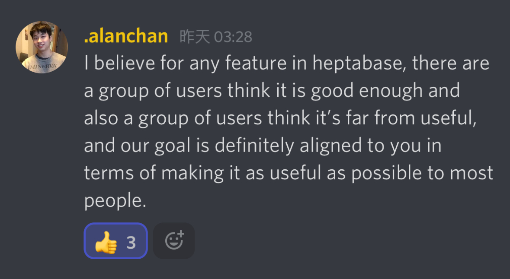

## 用戶反饋觀察
[2024/06/23 Twitter 紀錄](https://x.com/MileyChen0u0/status/1804893133836357976)

近期打開 Heptabase 的 Discord 中文頻道感受到部分用戶們對更新速度有些失去耐心，自己是佛系用戶又前陣子剛好翻到 roadmap 已經有接下來的功能很大型的預期，所以看到那些回饋以後多思考了一下才比較理解這個現象，小小記錄想到的影響因素

### 1. 預期心理
早期用戶習慣並且預期反饋能有很即時的更新，也許不會認知到在功能越來越進階/龐大、維運量增加、且團隊還沒什麼擴張的前提下，delivery 是會慢下來的。

### 2. 對產品的核心期待
可以想見用戶是被卡片、白板吸引使用並對這些核心功能有很多的期待，以致會認定這應是官方主要更新的方向。近期看起來錯誤修復外比較多是在提升效能（部分用戶感受度較低、減少不滿意但不會增加滿意度）、開發新戰場（APP 、web clipper、collaboration），認定核心價值在透過卡片與白板建立理解且專心在用這些功能的用戶可能會因核心期待未被滿足而開始不滿。

### 3. 對基本型需求的認知差異
觀察下來發現思考工具很容易因為個人流程的不同而造成對特定功能有達成基本品質的認知跟其他用戶 / 產品團隊不同，這種差異會造成更容易有不滿意的用戶出現。

### 4. 複數新戰場
近期做的每一步都很合理，可以看出真的有蒐集用戶的反饋並和願景做對映，但每開一個新大型功能就是新戰場，上架 APP 就會開始要滿足行動裝置的情境、上架 web clipper 就會有和其他擷取工具的比較、接下來好像是共享及權限管理，在開啟各種新戰場的情況下，許願、錯誤回報、期待的擴張也會接踵而來。

```
note.
其實後來發現持續激烈抱怨的多是特定的人，這就是所謂黑粉嗎 XD
```

## 一些觀點
:::warning 以下是對其公司內部運作情況不了解的情況下，純粹自己的產品思考練習。
:::

### 許願數量與實際影響力的關聯性
雖然我自稱佛系用戶，其實也還是會有一些對白版和功能推出順序上的失望，Heptabase 讓我喜愛的地方仍在，但自己對於短期內更新不太抱有期待、加上上面提到部分用戶有點失去耐心，讓我自顧自擔心起來。（OS：不可以倒啊找跟換軟體很麻煩的）

有在 Heptabase 的 DC 頻道的用戶，大概會知道團隊很常會在上面搜集用戶意見，HB 會在透過投票搜集意見、也會在功能研究時透過客服針對許願用戶詢問問題，這種高互動性、高回饋感的使用體驗一直是我覺得很棒也讓我很願意使用他們 in app support 的原因。但在看到功能排序是用投票數量來安排（希望還有其他指標只是沒揭露）、每每會有用戶出來抱怨優先級時，我不禁會懷疑**反饋數量多真的代表最重要**嗎？按照用戶許願數來安排開發順序是最有效益的排法嗎？會不會不一一照大家想法，但做出核心功能的整體重大更新，用戶滿意度反而更加提升？這些問題不管怎麼回答，如果沒有再做進一步的調查，都只會是我個人的主觀想法。

### 為什麼要思考這個問題

第一直覺想到的是在 in app support 回報 bug 時，會有初步的檢傷分級，詢問錯誤對用戶的影響程度，但在許願的部分卻沒有類似的機制我感到有些可惜。

第二層想到的則是自己的工作經驗上，有很多的許願也許會來自於「用戶因為使用其他產品覺得這個功能不錯，因此也覺得這個產品應該要有」，若單純用許願數量來排定功能規劃，很容易踏入「競品有所以我也該有」的思路中，因而忽視遺失用戶的核心目的以及產品本身的功能一致性。

最後，我自己認為複數新戰場是個有些大膽的舉動，Heptabase 有龐大的願景，但在現階段人力有限的狀態下應該要確保量能都被花在刀口上，而我想嘗試瞭解決定往這些方向去的原因。

### 如果是我，會如何行動
#### 1. 瞭解這些許願功能對用戶的真實影響力

文章前方有提到的「基本型需求」其實是來自於 KANO 模型的分類屬性，而這個部分如果在 in app support 搭配簡易的相關問答可以很快速地搜集。

參考[設計方法論-狩野分析(Kano model)](https://medium.com/@jessylee2208/%E8%A8%AD%E8%A8%88%E6%96%B9%E6%B3%95%E8%AB%96-%E7%8B%A9%E9%87%8E%E5%88%86%E6%9E%90-kano-model-3b8a46dc8bf8) 使用 Kano 的兩個問項，就可以對於初步達到分級驗證重要度的目標：
| 1. 如果具備這個功能時，你覺得如何？| 2. 如果沒有這個功能時，你覺得如何？ |
| :---:| :---:|
| 喜歡／應該的／無所謂／能忍受／不喜歡 | 喜歡／應該的／無所謂／能忍受／不喜歡 |


#### 2. 評估重要程度與量能，檢視優先級排序
在明確的公司願景藍圖以外，我先假設有一個排序優先序的模型在被使用（可以參考[用公式計算產品優先級](https://medium.com/as-a-product-designer/%E5%B0%8D%E6%8A%97%E4%BA%BA%E9%A1%9E%E7%9B%B4%E8%A6%BA-%E7%94%A8%E5%85%AC%E5%BC%8F%E8%A8%88%E7%AE%97%E7%94%A2%E5%93%81%E5%84%AA%E5%85%88%E7%B4%9A-moscow-rice-kano-lean-prioritization-%E6%A1%86%E6%9E%B6%E6%95%B4%E7%90%86-3af210e499f0)），以 RICE 模型來說，目前有在進行搜集的許願數量與 Reach 有所相關，而另一個正向影響因子 Impact 可以由第一點蒐集到的 Kano 去評量，Confidence 目前覺得是個憑感覺的指標（喂），用這些與團隊量能相比較，可以幫助瞭解重要功能相互排擠的情況，在排序大小功能更新時程時，也許有更好管理用戶預期的方式。

#### 3. 總而言之
團隊可能早有自己一套評估的方式，但 in app support 累積數量以外，用一些量化數據蒐集與驗證實際影響力也許是可以 laverage HB 用戶願意踴躍提供意見的這個優勢。現實來說產品是永遠無法滿足所有用戶的，但持續思考如何最佳地運用有限的資源在對產品有最多正面影響的方向上是重要的一件事。

#### 4. 這次思考沒有釐清的
- 持續開啟新戰場的同時，HB 如何去評估每個功能有達到一定的可用基礎
- 在尚未擴張的小小團隊組成下（雖然已有在招人）如何處理擴增的維運與大型開發計畫
- 在核心功能沒有減弱的狀態下，這些與更新速度、更新方向相關的用戶不滿，會如何影響到留存


## 後記更新
（Alan 在回與上述無關的留言，單純覺得很適合放在這裡）


