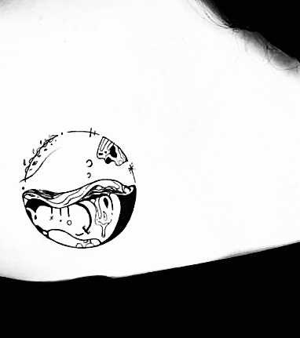

# 溺水

這幾天的自己和世界像是隔了一層膜，這裡的空氣稀薄、水位高漲，外邊則是閃閃亮亮喧喧鬧鬧，但隔著膜我看不清也聽不懂那些愉悅。
這種時候我通常都會知道自己正在「溺水」，我的能量流失到不知何處，體內只剩下難過、焦慮、無力感在無聲地尖叫。

沒有人會聽得到溺水的人的尖叫，只有我自己在感受和壓抑著那種靈魂的顫抖，和那雪上加霜的子宮內膜剝落。  
溺水加失血，真是最糟糕的組合了。

這個禮拜每天都在掙扎著要不要請假來面對這個狀態，但總是有千百個理由在阻止我。  
理智告訴我，在我窒息以前都好，那個假單還是送一下得好。

---
**Throwback: My Tatoo**



```
我的設想是如同溺水 而她的形容是浮沉
但我們都漂流在同一片汪洋
越掙扎只會更深地沉淪
想逃跑卻不知道怎麼樣才能靠岸

虛構出來的壓力太過沈重
又太害怕害得別人也一起承受
所以總是把自己圈起來
沒有力氣走出去 也不敢放別人進來

用了好久才慢慢理解
關住我的是那一層層
照著那些「應該」而描繪出來的泡影
看似一戳就破
卻怎麼都與我如影隨形
```